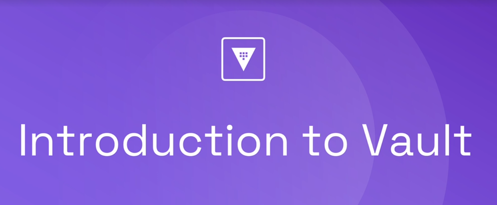
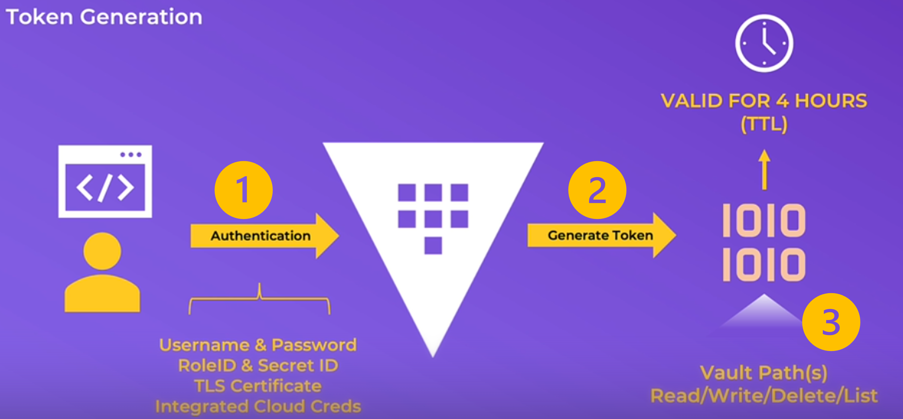
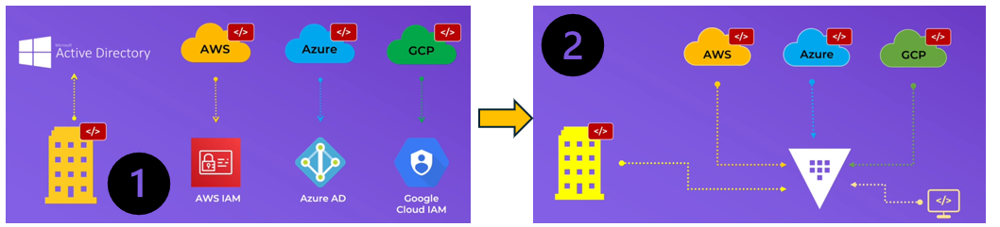

# **Terraform Vault**

    

HashiCorp Vault works as an identity-based system for managing secrets (like API keys, passwords, certificates) by centralizing them, encrypting them at rest and in transit, and controlling access through authentication, authorization policies, and dynamic generation. It eliminates hardcoded secrets by having applications and users authenticate to Vault, which then issues temporary, leased credentials or allows access based on defined policies, ensuring secure, auditable, and restricted access. 

# **What is Vault**
Vault is an agnostic Hashicorp solution which enables:
- Manage secrets and Protect Sensitive data
- Provide a single source of truth as far as secret management is concerned
- Provide a complete Mife Cycle Management for secret
- Support regulatory and compliance
- Manage identities and authentication

Secrets can be:
- Username and passwords
- Certificates
- API keys
- Encryption keys

# **How It Works**

    

**1.** Application (API) or a Machine (CLI) or a Human/User (UI) would like to interact with Vault. They authenticate to Vault using different authentication methods: 
- **Username & Password**: human (user) authentication
- **RoleID & Secret ID**: API or Machine authentication
- **TLS Certificate**: API or Machine authentication
- **Integrated Cloud Creds**: Human or Machine authentication

**2.** Once Vault validates the authentication method, it will generate a **`token`**. This token is valid for un certain amount of time refered by the term TTL (Time To Live). 

**3.** The token provide access to the path and you can Read/Write/List the path according to the auhorization provided.

# **Why Choosing Vault**

    

**1.** Most of platforms have their own Identity Providers (IDP). The problem of migrating applications or running applications across those different platforms or cloud providers is sometime a challenge. Vault comes with a solution to face this important challenge. 

**2.** For instance, instead of migrating individually with each IDP, all those platforms can be integrated directly in vault with vault alone. So Vault can go dynamically grab credentials out of each one of the platforms. What the applications only have to do, it's go to Vault, because Vault is the single source of trust for all of the different IDPs.

# Role Play
[How Vault help improve our Security Posture](./pages/RP1_How_Vault_Improves_Security.md)

# What next ?
[Installing and running Vault](./pages/Lesson1_Installing_and_running_vault.md)

