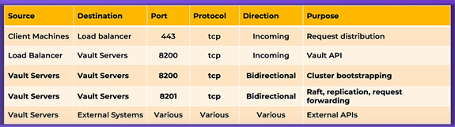

# Vault Replication

## Vault Replication - `Overiview`

Many organizations have infrastructure that spans multiple datacenters. Vault provides the critical services of identity management, secrets storage, and policy management. This functionality is expected to be highly available and to scale as the number of clients and their functional needs increase; at the same time, operators would like to ensure that a common set of policies are enforced globally, and a consistent set of secrets and keys are exposed to applications that need to interoperate.

Vault replication addresses both of these needs in providing consistency, scalability, and highly-available disaster recovery.

- Only available on **Vault Enterprise**
- Replication operates on a **leader-follower mode**l (**primaries** and **secondaries**)
- The primary cluster acts as the systemof record and replicates most Vault data asynchronously.
- All communications between primaries and secondaries is **end-to-end encrypted** with mutually-authenticated TLS sessions

## Vault Replication - `Replicated data` 

What data is replicated between the primary and secondary depends on the type of replication that is configured between the primary and secondary. There are 02 types of replication that Vault Enterprise supports
- **Performance Replication**
- **Disaster Recover Replication**

### Performance Replication

In Performance Replication, secondaries keep track of their own tokens and leases but share the underlying configuration, policies, and supporting secrets (KV values, encryption keys for transit, etc).

If a user action would modify underlying shared state, the secondary forwards the request to the primary to be handled; this is transparent to the client. In practice, most high-volume workloads (reads in the kv backend, encryption/decryption operations in transit, etc.) can be satisfied by the local secondary, allowing Vault to scale relatively horizontally with the number of secondaries rather than vertically as in the past.

- Replicates the underlying confiuration, policies and others data
- Ability to service reads from client requests, but writes requests are only performed by the Primaries.
- Clients will authenticate to the performance-replicated cluster separately
- Does not replicate tokens or leases to performance secondaries

### Disaster Recovery Replication (DR)

In disaster recovery (or DR) replication, secondaries share the same underlying configuration, policy, and supporting secrets (KV values, encryption keys for transit, etc) infrastructure as the primary. They also share the same token and lease infrastructure as the primary, as they are designed to allow for continuous operations with applications connecting to the original primary on the election of the DR secondary.

DR is designed to be a mechanism to protect against catastrophic failure of entire clusters. They do not forward service read or write requests until they are elected and become a new primary.

- Replicates the underlying configuration, policies and other data
- **Cannot** service reads from client requests
- Clients will authenticate to the primary cluster ony (or a performance cluster)
- Wll replicate tokens and leases created on its primary cluster
- Provides a **warm-standby** cluster where EVERYTHING is replicated to the DR secondary cluster(s)
- DR clusters **DO NOT** respond to clients unless they are promoted to a primary cluster
- Even as an admin or using a root token, most paths on a secondary cluster are disabled, meaning you can't do much of anything on a DR cluster

### Comparative Table

<table>
    <thead>
        <tr><th>Capability</th><th>Disaster Recovery</th><th>Performance Replication</th></tr>
    </thead>
    <tbody>
        <tr>
            <td>Mirrors the configuration of a primary cluster</td><td>Yes</td><td>Yes</td></tr><tr><td>Mirrors the configuration of a primary cluster’s backends (i.e., auth methods, secrets engines, audit devices, etc.)</td><td>Yes</td><td>Yes</td>
        </tr>
        <tr>
            <td>Mirrors the tokens and leases for applications and users interacting with the primary cluster</td><td>Yes</td><td>No</td>
        </tr>
        <tr>
            <td>Allows the secondary cluster to handle client requests</td><td>No</td><td>Yes</td>
        </tr>
    </tbody>
</table>

## Vault replication - `Networking Requirements`

- Communication between cluster must be permitted to allow replication, RPC forwarding and cluster bootstrapping to work as expected
- If using DNS, each cluster must be able to resolve the name of the other cluster

<p>
    
</p>


# Vault Replication - `Setting Replication`

1. Activating Primary
- Replication is not enabled by default, so you must enable it on each cluster that will participate in the replica set.
- Enables an internal root CA on the primary Vault cluster, then creates a root certificate and client cert
- Vault creates a mutual TLS connection between the nodes using self-signed certificates and keys from the CA, NOT the same TLS configured for the listener
    - If Vault sits behind a load balancer that is terminating TLS, it will break the mutual TLS between the nodes if inter-cluster traffic is forced through the load balancer

2. fetch Secondary token 
- Create a secondary token on the Primary cluster for the DR Secondary
- A secondary token is required to permit a secondary cluster toi replicate rom the primary cluster
- Due to its sensitivity, the secondary token is protected with response wrapping
- Multi people should have eyes on the secondary token once it's been issued until it is submitted to the secondary cluster
- Once the token is successfully used, it is usless (single-use token)
- The secondary token includes information such as
    - The redirect address of the primary cluster
    - The client certificate and CA certificate

3. Activating Secondary: Activate DR Replication on the Secondary cluster as a DR secondary. We provide the token for the DR secondary.

4. Replication: Watch Vault replicated the data from the Primary to the new Secondary cluster

# Confifure Replication using CLI

- Activate DR Replication (on the Primary cluster)

```bash
vault write -f sys/replication/dr/primary/enable
```

- Create the Secondary Token (on the Primary cluster)

```bash
vault write sys/replication/dr/primary/secondary-token id=<id>
```

This command will gnerate a token for the Secondary cluster.

- Activate the Secondary Cluste (on the Secondary cluster)

```bash
vault write -f sys/replication/dr/secondary/enable token=<token>
```

# Documentation

- [Replication support in Vault](https://developer.hashicorp.com/vault/docs/enterprise/replication)
- [Enable performance replication](https://developer.hashicorp.com/vault/tutorials/enterprise/performance-replication)
- [Enable disaster recovery replication](https://developer.hashicorp.com/vault/tutorials/enterprise/disaster-recovery)
- [Monitor enterprise replication](https://developer.hashicorp.com/vault/tutorials/monitoring/monitor-replication)


