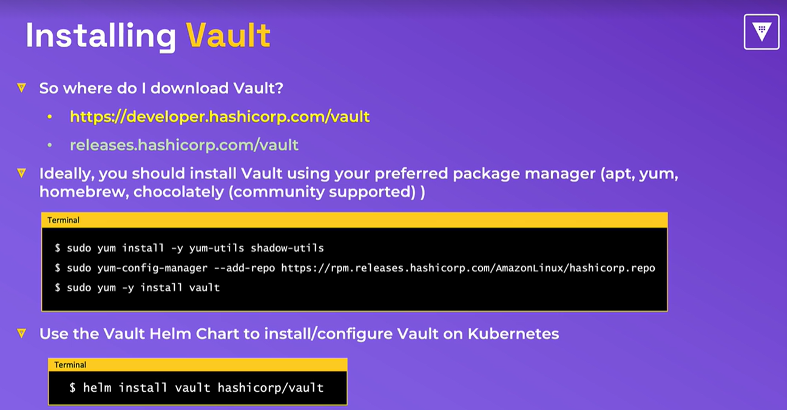
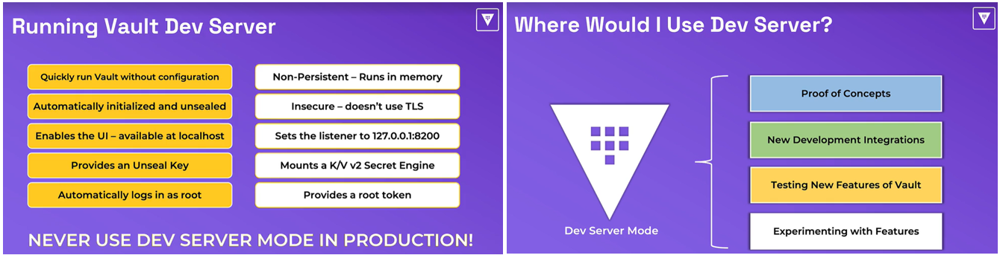
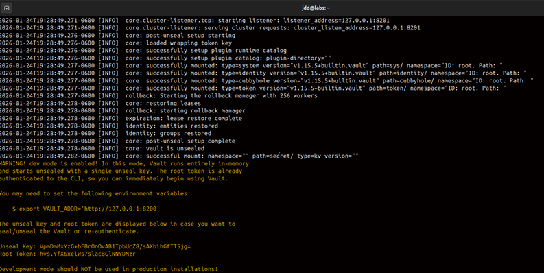
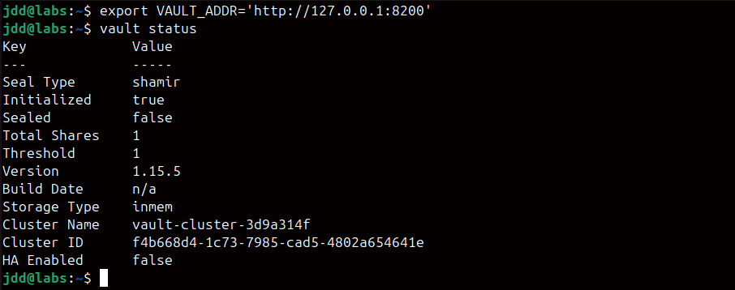
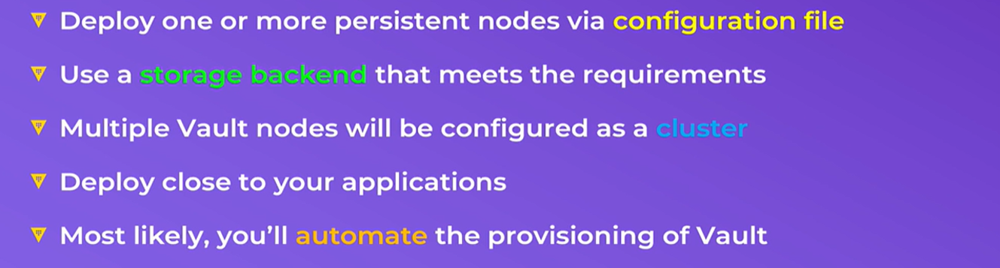
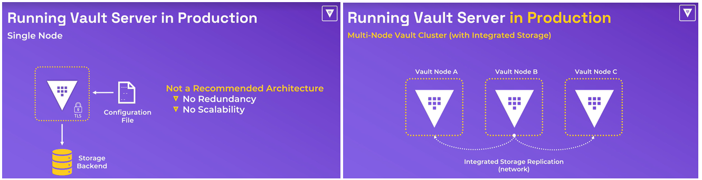
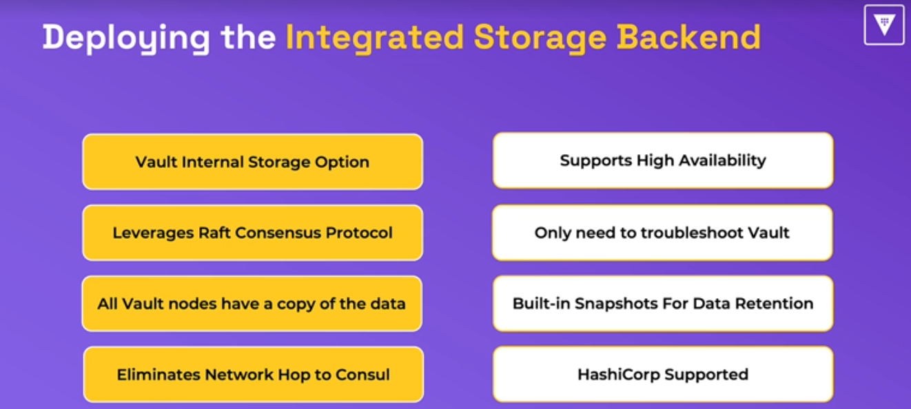

# Installing Vault

<p align="center">
    
</p>

## Installing Vault on Linux Ubuntu

1. Go to the following [link](https://releases.hashicorp.com/vault) and see the available vault version for your computer achitecture 
2. Open a terminal on your Linux machine
3. Type the following command to download the zip file of the vault version in the `/tmp` repository

```bash
curl --silent -Lo /tmp/vault.zip https://releases.hashicorp.com/vault/1.15.5/vault_1.15.5_linux_amd64.zip
```
4. Go to the `/tmp` directory and unzip the file

```bash
cd /tmp
unzip vault.zip
```

5. Move the new vault directory to /usr/local/bin

```bash
sudo mv vault /usr/local/bin
```

6. Test the installation by typing the command

```bash
vault version
```

# Running Vault Dev Server
## Introduction

<p align="center">
    
</p>

## Running Vault in Dev mode
1. Make sure you have downloaded and install Vault
2. Open a new terminal on your computer
3. Type the following to run Vault in Dev mode

```bash
vault server -dev
```
<p>
    
</p>

4. Open a new terminal and type the following command

```bash
export VAULT_ADDR='http://127.0.0.1:8200'
```

5. Test Vault in Dev mode. Check the status of Vault.

```bash
vault status
```
<p>
    
</p>

# Running Vault in Prod mode
## Introduction

<p align="center">
    
</p>
<p align="center">
    
</p>

## Basics configurations to run Vault in Production Mode
1. Make sure that Vault is correctly installed on your computer
2. Open a new terminal
3. Create a group user for Vault

```bash
sudo groupadd --force --system vault
```

4. Adding Vault system users

```bash
sudo adduser \
      --system \
      --ingroup vault \
      --home /srv/vault \
      --no-create-home \
      --comment "Vault account" \
      --shell /bin/false \
      vault  
```

5. Create and manage permissions on directories

```bash
sudo mkdir -pm 0750 /etc/vault.d /var/lib/vault /opt/vault/data
sudo mkdir -pm 0700 /etc/vault.d/tls
sudo chown -R vault:vault /etc/vault.d /opt/vault/data
```

6. Create the vault configuration file called **`vault.hcl`** in **/etc/vault.d/** with the following content
```bash
sudo vi /etc/vault.d/vault.hcl
```

```bash
storage "raft" {
  path    = "/opt/vault/data"
  node_id = "node-a-us-east-1"
  retry_join {
    auto_join = "provider=aws region=us-east-1 tag_key=vault tag_value=us-east-1"
  }
}

seal "awskms" {
  region = "us-east-1"
  kms_key_id = "9d1b7e9f-e793-48db-85a3-0366505eb640"
}

listener "tcp" {
 address = "0.0.0.0:8200"
 cluster_address = "0.0.0.0:8201"
 tls_disable = 1
}

api_addr = "https://192.168.1.73:8200"
cluster_addr = "https://192.168.1.73:8201"
cluster_name = "vault-prod-us-east-1"
ui = true
log_level = "INFO"
```

7. Create the vault service file **`vault.servie`** in **/etc/systemd/system** with the following content
```bash
sudo vi /etc/systemd/system/vault.service
```

```bash
[Unit]
Description="HashiCorp Vault - A tool for managing secrets"
Documentation=https://www.vaultproject.io/docs/
Requires=network-online.target
After=network-online.target
ConditionFileNotEmpty=/etc/vault.d/vault.hcl

[Service]
# Make sur to run Vault as a user and non as a root
User=vault
Group=vault

# Sandboxing settings to improve the security of the host by restricting vault privileges and access
ProtectSystem=true
ProtectSystem=full
ProtectHome=read-only
PrivateTmp=yes
PrivateDevices=yes

# Configure the capabilities of the vault process, particularly to lock memory.
# (support for multiple systemd versions)
SecureBits=keep-caps
AmbientCapabilities=CAP_IPC_LOCK
Capabilities=CAP_IPC_LOCK+ep
CapabilityBoundingSet=CAP_SYSLOG CAP_IPC_LOCK

# Limit the number of file descriptors to the configured value and prevent memory being swapped to disk
LimitNOFILE=65536
LimitMEMLOCK=infinity

# Prevent vault and any child process from gaining new privileges
NoNewPrivileges=yes

ExecStart=/usr/local/bin/vault server -config=/etc/vault.d/vault.hcl
ExecReload=kill --signal HUP $MAINPID
KillMode=process
KillSignal=SIGINT
Restart=on-failure
RestartSec=5
TimeoutStopSec=30
StartLimitBurst=3

[Install]
WantedBy=multi-user.target
```

8. Adjusting the permission on the vault service file

```bash
sudo chmod 0664 /etc/systemd/system/vault.service
```

9. Reload the daemon

```bash
sudo systemctl daemon-reload
```

## Launching Vault in Production Mode
Vault in Prod Mode must be run as a user but not as root. Make sure that you exit as root in the actual terminal or simply open a new terminal and launch the Vault service.

```bash
sudo systemctl start vault
```
```bash
sudo systemctl status vault
```

# Running Vault using Integrated Storage Backend (Raft)

<p align="center">
    
</p>

## Deploying the Integrated Storage Backend
- Integrated Storage (**Raft**) allows Vault nodes to provide its own replicated storage across the vault nodes within a cluster
- Define a **local path** to store replicated date
- All data is replicated among **all nodes** in the cluster
- ELiminates the need to run a Consul cluster and manage it

[Demo Deploying the Integrated Storage Backend]()