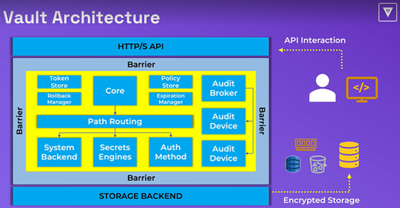
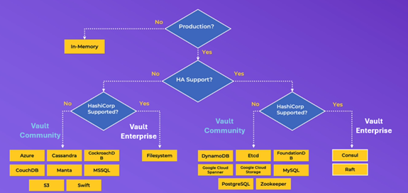
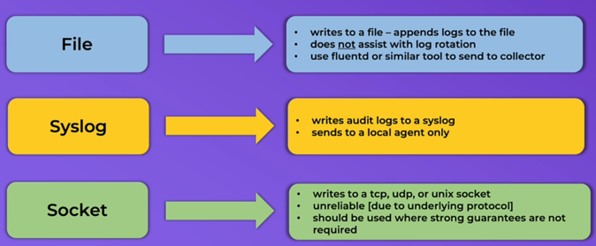
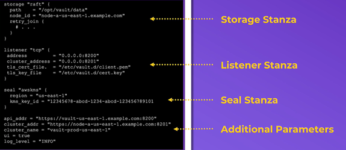

# 1. Vault Components

1. Storage Backend
2. Secret Engine
3. Authentication Methods
4. Audit Divices

## 1.1 Storage Backend
- Configures the **location** for storage of Vault data. When you make any configuration changes in vault, it stores it in storage backend.
- Storage is defined in the **main Vault configuration file** (ex. /etc/vault.d/vault.hcl) with desired paramaters
- All data is encrypted in transit (TLS) and at rest using AES256
- Not all storage backends are created equal
    - Some support high availability 
    - Others have better tools for management and data protection (dynamoDB, S3 bucket)
- There is **only one** storage backend per Vault Cluster. So if you have 6 clusters in your envoronment, then you will have 6 different storage backend

## 1.2 Secret Engine
- Responsible for managing secrets for organization
- Secrets Engines can **store**, **generate** or **encrypt** data. Thos are the 3 fonctions of Secret Engines.
- Many secrets engines connect to other platforms to generate dynamic credentials on demand
- Multiple secrets engines can be enabled and used as needed, even multiple secrets engines of the same type as longer the pathname is different.
- Secret engines are enables and isolated at a **path**. All interactions are done directly with the path itself.

## 1.3 Authentication Methods
- Performs **authentication** and manage **identities**
- Responsible for assigning identity and policies to a user
- Multiple authentication methods can be enbaled depending on your use case. Auth methods can be differentiated by **human vs system** methods
- Once authenticated, Vault will **issue a client token** used to make all subsequent Vault request (read.write)
    - The **fundamental goal** of all auth methods is to obtain a token
    - Each token jas an associated **policy (or policies)** and a **TTL**
- Dafault authentication method for a new Vault deployment = **tokens**

## 1.4 Audit Devices
- Keeps detailed log of all **requests** and **responses** to Vault
- Audit log is formatted using **JSON**
- **Sensitive information is hashed** before logging, using HMAC-SH256 to ensure secrets and tokens aren't ever stored in plain text
- Can (and should) have more than one audit device enabled
    - Vault requires at least one audit device to write the log before completing the Vault request - if enabled.
    - **Prioritizes safety over availability**


# 2. Vault Architecture
<p>
    
</p>

- Users interact with Vault using the API (HTTP or HTTPS)
- Storage backend provide an encrypted Storage for Vault. It could be Consul, S3 bucket or DynamoDB
- The Core component (in the middle) are protected with a Barrier. To get through, you must have a token means you must be authenticated. So everything that moves outside of the barrier is encrypted. Any data that comes into the Core is decrypted. 

## 2.1 Vault Paths
- Everything in Vault is **path-based**
- The path **prefix** tells Vault which component a request should be routed
- Secret engines, auth methods and audit devices are mounted at a specified path, often referred to as a **mount**.
- Paths available are dependant on the features enabled in Vault, such as Auth Methods and Secrets Engines
- System backend is a default backend in Vault xhixh is mounted at the /sys endpoint.
- Vault components can be enabled at **ANY** path you'd like using the **-path** flag. Each component does have a **default path **you can use as well
- Vault has a few System Reserved Path which you cannot use or remove:
    - **auth/**: Endpoint for auth method configuration
    - **cubbyhole/**: Endpoint used by the Cubbyhole secrets engine
    - **identity/**: Endpoint for configuring Vault identity (entities and groups)
    - **secret/**: Endpoint used by Key/Value v2 secrets engine **if running in dev mode**
    - **sys/**: System endpoint for configuring Vault

## 2.2 Storage Backend
**Vault Community and Vault Enterprise**
- **Vault Community** users can choose a storage backend based on their preferences (for the most part)
- **Vault enterprise** clusters should use **HashiCorp Consu**l or **Integrated Storage**.
- Everything else is community-supported and can be used for Vault Community

**Replication**
- Replication is a feature of Valut enterprise version
- When we deploy a Vault cluster, all those nodes will interact with the same storage backend. 
- Remmeber that there is only one storage backend per Vault cluster. 
- Only one node is active at the same time, the others remain in standby. 
- Storage backend of the cluster #1 (ex. DynamoDB) can be different to the Storage Backend of Cluster #2 (ex. Raft)
- Replication doesn't happen between the Storage Backends 
- Replication happens using API between the Vault nodes themselves. So Nodes talk to each other during replication

**How to select a storage backend**
<p>
    
</p>

## 2.3 Audit Device
- Keep a detailed log of all athenticated requests and responses to Vault
- Log files should be protected, as a user with permission can still check the value of those secrets vi the **/sts/audit-hash** API and compare it to the log file.
- To store your log in the local file, you type the command below

```bash
vault audit enable file file_path=/var/log/vault_audit.log
```

The differnt audit devices are shown in the table below.
<p>
    
</p>


# 3. Vault Initialization
- Initializing Vault **prepares the backend storage** to receive data
- Only need to initialize a Vault cluster **one time** via a single node
- Vault initialization is when Vault **creates the Root Key and Key shares**
- Options to define 
    - thresholds, 
    - key shares, 
    - recovery keys, 
    - and encryption
- Vault initialization is also where the initial Root Token is generated and retirned to the user
- Vault can be initialized via CLI, API or UI

```bash
vault operator init <options>
```

# Vault Configuration file
- Vault servers are configured using a file written in HCL or JSON
- The configuration file includes different stanzas and parameters to define a variety of configuration options
- Configuration file is usually stored in /etc/vault.d/vault.hcl
- Configuration file is specified when starting Vault using -config flag

```bash
vault server -config <location>
```
```bash
vault server -config /etc/vault.d/vault.hcl
```

- what(s configured in the file)
    - Storage backend; where is the storage backend (Raft, Consul, DynamoDB etc) ?
    - Listener(s) and Port: what interfaces and port ?
    - TLS certificate: what certificate and paths ?
    - Seal Type and Config: which seal type (Cloud auto unseal, transit auto unseal) ? 
    - CLuster Name: identifier for the cluster
    - Log Level: specifies the log level to use (Trace, Debug, Error, Warn, Info)
    - UI: enables the built-in web UI
    - Cluster IP and Port: address to advertise to other Vault servers for request forwarding

- How a configuration file looks like
```bash
stanza1 "option" {
    <parameter1> = <value1>
    <parameter2> = <value2>
    <parameter3> = <value3>
}

stanza2 "option" {
    <parameter1> = <value1>
    <parameter2> = <value2>
}

<parameter1> = <value>
<parameter2> = <value>
<parameter2> = <value>
```

- Available Stanzas
    - seal - seal type
    - listener - addresses.ports for Vault
    - storage - storage backend configuration
    - telemetry - where to publish metrics to upstream systems

<p>
    
</p>


# Next

[Lesson 3: Sealing and Unsealing](Lesson3_Seal_Unseal.md)
