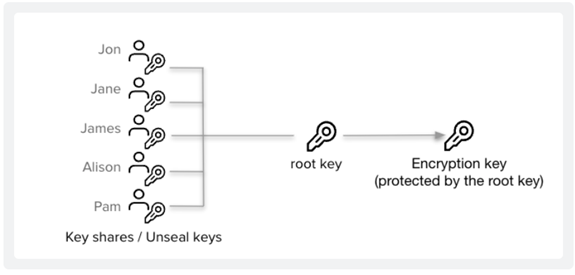
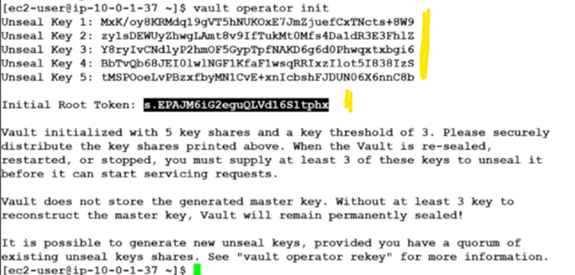
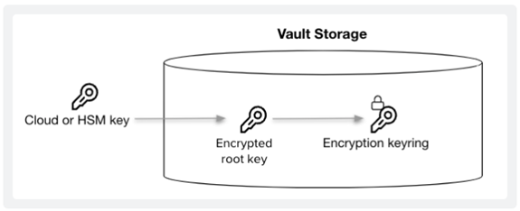
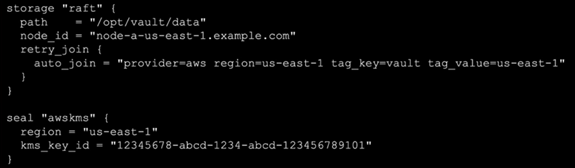
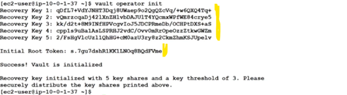
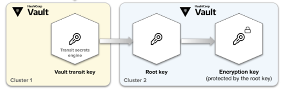
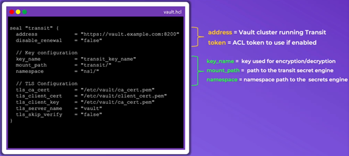

# Vault Seal and Unseal

## 1. Data Protection

- Vault encrypts the data using an **Encryption Key** (in the keyring) and stores them in its storage backend. To protect this encryption key, Vault encrypts it using another encryption key known as the **Root Key** and stores it with the data.
- To decrypt the data, Vault needs the root key so that it can decrypt the encryption key. Unsealing is the process of getting access to this root key. Vault encrypts the root key using the unseal key, and stores it alongside all other Vault data.
- When you start a Vault server, it starts in a sealed state. In this state, Vault can access the physical storage, but it cannot decrypt any of the data on it.
- Unsealing is the process of obtaining the plaintext root key that is necessary to read the decryption key. Prior to unsealing, the only possible Vault operations are to unseal the Vault and check the status of the server.

To summarize, Vault encrypts most data using the encryption key in the keyring. To get the keyring, Vault uses the root key to decrypt it. The root key itself requires the unseal key to decrypt it.

## 2. Seal and Unseal
- Vault starts in a **sealed state**, meaning that it knows where to access the data and how, but cannot decrypt it
- Almost no operation is possible when Vault is in sealed state (only status check and unsealing are possible)
- **Unsealing Vault** means that a node can reconstruct the **Root Key** in order to decrypt the **Encryption Key** and ultimately read the data. After unsealing, the Encryption Key is stored in Memory
- **Sealing Vault** means that Vault throws away the Encryption Key and requires another unseal to perform any futher operation.
- Vault can be **sealed manually** using UI, CLI or API
- When would I seal Vault ?
    - Key shards are inadvertently exposed
    - Detection of a comprimised of network intruision
    - Spyware/Malware on the Vault nodes


## 3. Roles of Root Key and Encryption Key
**Root Key**
It is used to decrypt the Encryption Key
- Created during Vault initialization or during a rekey operation
- **Never written** to storage when using traditional unseal mechanism
- Written to **`core/master`** (storage backend) when using **AUto Unseal**

**Encryption Key**
It is use to encryt/decrypt data written to storage backend
- Encypted by the Root Key
- Stored in the encrypted format alongside the data in a keyring on the storage backend
- Can be easily rotated (manual operation)


# 4. Seal and Unseal Options
- Key Sharding (Shamir)
- Cloud Auto Unseal
- Transit Auto Unseal

## 4.1 Unsealing with Key Shards

<p>
    
</p>

- Instead of distributing the unseal key to an operator as a single key, the default Vault configuration uses an algorithm known as Shamir's Secret Sharing to split the key into shares.
- Vault requires a certain threshold of shares to reconstruct the unseal key. 
- Vault operators add shares one at a time in any order until Vault has enough shares to reconstruct the key. Then, Vault uses the unseal key to decrypt the root key. This is the Vault unseal process.
- **This is a default option** for unsealing, no configuration is needed
- **No signle person** should have access to all key shards
- Ideally, each key shard should be stored by a different employee
- Key shards **should not** be stored online and should be highly protected, ideally **stored encrypted**

```bash
vault operator init # will provide **Unseal Keys** and initial Root Token
```
<p>
    
</p>

```bash
vault operator unseal # will request unseal keys 
```
```bash
vault status # will provide the Status of Vault 
```

## 4.2 Unsealing with Cloud Auto Unseal

<p>
    
</p>

- Uses a **cloud** or **on-premises HSM** to decrypt the Root Key
- Vault **configuration file** (/etc/vault.d/vault.hcl) identifies the particular key to use

<p>
    
</p>

- Automatically unseals Vault upon service or node restart **without additional intervention**
- Available in **both** Community and ENterprise editions

```bash
vault operator init # will provide **Recovery keys** and initial Root Token
```
<p>
    
</p>

**Documentation**: [Auto-unseal Vault using AWS KMS](https://developer.hashicorp.com/vault/tutorials/auto-unseal/autounseal-aws-kms)


## 4.3 Unsealing with Transit Auto Unseal

<p>
    
</p>

Vault unseal operation requires a quorum of existing unseal keys split by Shamir's Secret sharing algorithm. This prevents one person from having full control of Vault. However, this process is manual and can become painful when you have several Vault clusters as there are now different key holders with different keys.
However, this process is manual and can become painful when you have several Vault clusters as there are now different key holders with different keys. Vault supports opt-in automatic unsealing via transit secrets engine. This feature enables operators to delegate the unsealing process to a trusted Vault environment to ease operations.

- Uses the Transit Secret Engine of a different Vault cluster
- The Transit Secret Engine may be configured in a Namespace
- The Transit Unseal supports key rotation
- Available in Comunity and Enterprise
- The centralized Vault cluster must be highly available
- Vault **configuration file** (/etc/vault.d/vault.hcl) contains the configuration of the transit

<p>
    
</p>

# Documentation

[Auto-unseal Vault using transit secrets engine](https://developer.hashicorp.com/vault/tutorials/auto-unseal/autounseal-transits)


# Next

[Lesson 4: Authentication Methods](Lesson4_Auth_Methods.md)
