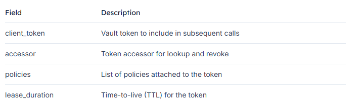
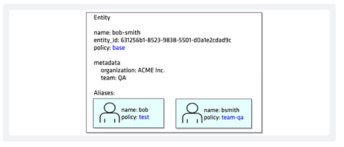

# Authentication Methods

Authentication in Vault is the process by which user or machine supplied information is verified against an internal or external system. Vault supports multiple auth methods including GitHub, LDAP, AppRole, and more. Each auth method has a specific use case.

Before a client can interact with Vault, it must authenticate against an auth method. Upon authentication, a token is generated. This token is conceptually similar to a session ID on a website. The token may have attached policy, which is mapped at authentication time. This process is described in detail in the policies concepts documentation.

Auth methods are the components in Vault that perform authentication and are responsible for assigning identity and a set of policies to a user. In all cases, Vault will enforce authentication as part of the request processing. In most cases, Vault will delegate the authentication administration and decision to the relevant configured external auth method **(e.g., Amazon Web Services, GitHub, Google Cloud Platform, Kubernetes, Microsoft Azure, Okta ...)**.

Having multiple auth methods enables you to use an auth method that makes the most sense for your use case of Vault and your organization.

# 1. Configuring Auth Methods

## 1.1 Vault Auth Methods using CLI


```bash
vault auth <command>
```
`<command>` can be:

- **`enable`** - enable a new auth method
- **`disable`** - desable a auth method (the name ot he mount we want to disable not the type of the auth method)
- **`list`** - list enabled auth methods 
- **`tune`** - used to modify an auth method
- **`help`** - show information how to use vault auth commande

```bash
# Enables the auth method approle at the default path
vault auth enable approle 
```
```bash
# Enables the auth method approle at a custom path vault-course
vault auth enable -path=vault-course approle 
```
```bash
# List enabled auth methods
vault auth list 
```
```bash
# Disables the auth method approle at a custom path vault-course
vault auth disable vault-course 
```

### Userpass Auth Method using CLI

**1. Enable an Auth Method userpass on the path jdtech**

```bash
vault auth enable -path=jdtech -description="Local credentials for Vault" userpass
```

**2. Create a user John and assign a password and policies on the auth method jdtech**

```bash
vault write auth/jdtech/users/john password=vault policies=vault-policy
```

**3. List the enabled auth methods on Vault server**

```bash
vault auth list
```

**4. List the users under the path jdtech**

```bash
vault list auth/jdtech/users
```

**5. Read/show the information related to the user john**
```bash
vault read auth/jdtech/users/john
```

### Approle Auth Method using CLI

**1. Enable an Auth Method approle on the path jdcloud**

```bash
vault auth enable -path=jdcloud -description="Cloud credentials for Vault" approle
```

**2. Create a user Joe and assign a password and policies on the auth method jdcloud**

```bash
vault write auth/jdcloud/role/joe \
    policies=vault-policy \
    token_ttl=20m
```

**3. List the enabled auth methods on Vault server**

```bash
vault auth list
```

**4. List the users under the path jdtech**

```bash
vault list auth/jdcloud/role
```

**5. Read/show the information related to the user john**

```bash
vault read auth/jdtech/role/joe
```

## 1.2 Vault Auth configuration using API

### Enable the AppRole Auth Method using API

- **Create an `auth.json` file:**

```bash
{
  "type": "approle"
}
```

- **Use `curl` to enable AppRole:**

```bash
curl --header "X-Vault-Token: $VAULT_TOKEN" \
     --request POST \
     --data @auth.json \
     http://127.0.0.1:8200/v1/sys/auth/approle
```

- **Verify the mount:**

```bash
vault auth list
```

You should see an entry for `approle/`.

### Create an AppRole with Policies

- **Define which policies this AppRole will use `policies.json`:**

```bash
{
  "policies": ["bryan"]
}
```

- **Create the AppRole named `vaultcourse`:**

```bash
curl --header "X-Vault-Token: $VAULT_TOKEN" \
     --request POST \
     --data @policies.json \
     http://127.0.0.1:8200/v1/auth/approle/role/vaultcourse
```

A successful response confirms the role is created.

### Fetch the Role ID

**Each AppRole has a unique `Role ID`. Retrieve it:**

```bash
curl --header "X-Vault-Token: $VAULT_TOKEN" \
     http://127.0.0.1:8200/v1/auth/approle/role/vaultcourse/role-id | jq
```

**Inspect `data.role_id` in the JSON response.**

## Generate a Secret ID

**Generate the `Secret ID` needed alongside the `Role ID`:**

```bash
curl --header "X-Vault-Token: $VAULT_TOKEN" \
     --request POST \
     http://127.0.0.1:8200/v1/auth/approle/role/vaultcourse/secret-id | jq
```

The response returns:

- `data.secret_id`
- `data.secret_id_accessor`

**With these credentials, you can log in:**

```bash
curl --request POST \
     --data '{"role_id":"<ROLE_ID>","secret_id":"<SECRET_ID>"}' \
     http://127.0.0.1:8200/v1/auth/approle/login
```


# 2. Vault Authentication

## 2.1 Vault Authentication using the CLI

There are a few ways to autenticate to Vault when using CLI

### Use the vault login command when using CLI

**Token Helper**

Caches the token after authentication. Stores the token in a local file so it can be referenced for subsequent requests.

```bash
vault login <User-Token> # By default, Vault login uses a token auth method
```

**authentication with userpass auth method using CLI**

```bash
vault login -method=userpass username=john # Used to obtain a token
```

**authentication with approle auth method using CLI**

When the **approle** auth method is already enabled and the role **john** is already created.

- **Get the `role-id`**

```bash
vault read auth/approle/role/john/role-id
```

- **Create the `secret-id`**

```bash
vault write -force auth/approle/role/john/secret-id
```

- **Create a login authentication**

```bash
vault write auth/approle/login \
    role_id=<role-id> \
    secret_id=<secret-id>
```

**authentication with okta auth method using CLI**

- **Connect to the okta platform and create a token**
- **Enable okta auth method in Vault**

```bash
vault auth enable okta
```

- **Create the configuration for okta auth**

```bash
vault write auth/okta/config \
    base_url = "okta.com"
    org_name = "<org-name>"
    api_token = "<token-created>"
```

- **Create an okta user**

```bash
vault write auth/okta/users/john@org-name.com policies=org-name-policies
```

- **User authentication**

```bash
vault login -method=okta username=john@org-name.com
```

### Use the VAULT_TOKEN Environment Variable

- Used if you already have a **token**
- Parsing the JSON Response to obtain the Vault Token

```bash
export VAULT_ADDR="https://vault.example.com:8200" # Vault endpoint
```

```bash
export VAULT_FORMAT=json # Send the response in JSON format every time
```

```bash
OUTPUT=$(vault write auth/approle/login role_id="1234567" secret_id="1abnc567hhdd") # Provide role-id and secret-id for authentication
```

```bash
VAULT_TOKEN=$(echo $OUTPUT | jq '.auth.client_token' -j) # Using jq to parse the JSON response
```

```bash
vault login $VAULT_TOKEN # Authentication with the token
```

## 2.2 Vault Authentication using the API

When you migrate from the Vault CLI to its HTTP API, authentication works slightly differently. Instead of the CLI persisting your token, the API returns a JSON payload containing:

<p>
    
</p>

You must parse this JSON response, extract the client_token, and include it in the X-Vault-Token header for all future requests.

**Note:**

**You’re not storing tokens on disk as the CLI does. Securely manage your tokens in environment variables or secret managers.**

### 1. Authenticating with AppRole
AppRole authentication allows machines or applications to authenticate to Vault. No existing token is required to perform this login.

**- Prepare the Login Payload**
Create a JSON file (**auth.json**) containing your AppRole credentials:

```bash
{
  "role_id": "<your_role_id>",
  "secret_id": "<your_secret_id>"
}
```

**- Send the Login Request**

```bash
curl --request POST \
     --data @auth.json \
     https://vault.example.com:8200/v1/auth/approle/login
```

    - `@auth.json`: Path to the JSON payload with role_id and secret_id.
    - Endpoint: **/v1/auth/approle/login** signals Vault to authenticate via AppRole.

**- Sample Response**
A successful AppRole login returns a JSON object similar to:

```bash
{
  "request_id": "0f874bea-16a6-c3da-8f20-1f2ef9cb5d22",
  "lease_id": "",
  "renewable": false,
  "lease_duration": 0,
  "data": null,
  "wrap_info": null,
  "warnings": null,
  "auth": {
    "client_token": "s.wjkffdrqM9QYTOYrUnUxXyX6",
    "accessor": "Hbhmd3OfVTXnukBv7WxMrWld",
    "policies": [
      "admin",
      "default"
    ]
  }
}
```
Extract the **auth.client_token** value—this is your Vault API token.

**- Using the Vault Token for Subsequent Requests**
Include the token in the **X-Vault-Token** header for all Vault API calls. For example, to read a secret at **secret/data/my-secret**:

```bash
curl --header "X-Vault-Token: s.wjkffdrqM9QYTOYrUnUxXyX6" \
     https://vault.example.com:8200/v1/secret/data/my-secret
```

Replace **my-secret** with the path to your desired secret. All reads, writes, renewals, and revocations follow the same pattern.

**Warning**

**Avoid exposing your Vault token in shared logs or command-history. Use environment variables or CI/CD secret storage to keep tokens confidential.**

### 2. Authenticating with okta

```bash
curl --request POST \
    --data @password.json \
     https://127.0.0.1:8200/v1/auth/okta/login/john@org-name.com | jq
```


# 3. Vault Entities

- An **Entity** is a representation of a single person or system used to log into Vault. Each has a unique value. Each **entity** is made up of zero or more **aliases**.
- **Alias** is a combinaison of the aut method plus some identification. It is a mapping between an **entity** and **auth method(s)**
- Vault create an **entity** and attaches an alias to it if a correponding entity doesn't already exist. This is done using the **identity secrets engine**, which manages internal identities that are recognized by Vault.

**Scenario 1**

<p>
    
</p>

- Julie is a user, a Finance Specialist
- She can log into Vault using userpass auth method
- When she has connected an Entity has been create made of the auth method and the username jsmith
- There are also some metadata to describe Julie and some policies

**Scenario 2**

In this scenario if Julie logs in using LDAP, the token that she gets is bound with finance policies. If she want to gather some information in accounts payable, she needs to log out from Vault from the LDAP and then log in with Github auth method.This is not efficient.

**Scenario 3**

Consolidating Logins under a Single Entity

- An entity can be **manually created** to map multiple entities for a single user to provide more efficient authorization managament
- Any tokens that are created for the entity **inherit the capabilities** that are granted by alias(es)

# Documentation

- [Auth methods](https://developer.hashicorp.com/vault/docs/auth)
- [AWS auth method](https://developer.hashicorp.com/vault/docs/auth/aws)
- [Okta auth method](https://developer.hashicorp.com/vault/docs/auth/okta)
- [Kubernetes auth method](https://developer.hashicorp.com/vault/docs/auth/kubernetes)
- [Vault Identity](https://developer.hashicorp.com/vault/tutorials/auth-methods/identity)
- [How to Configure Vault Authentication Methods](https://oneuptime.com/blog/post/2026-02-02-vault-auth-methods/view)
- [A Guide to securing your applications secrets with vault authentication](https://medium.com/@timzowen/a-guide-to-securing-your-applications-secrets-with-vault-authentication-4d23bc2a55ab)


# Next

[Lesson 5: Vault Policy](Lesson5_Policy.md)
