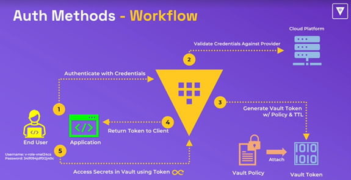
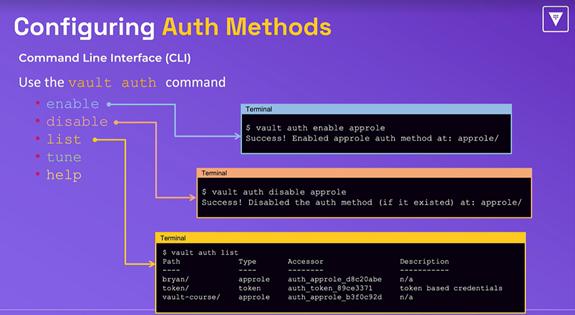
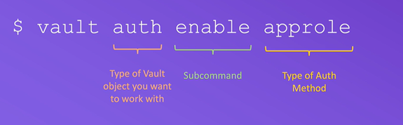
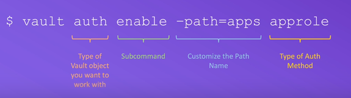
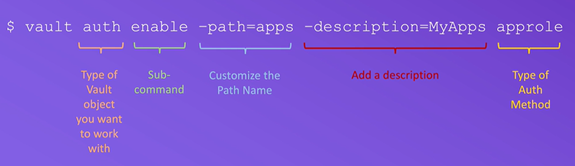
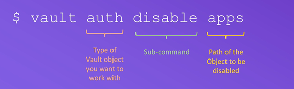
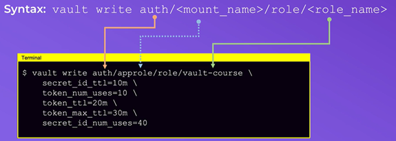
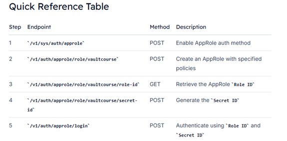

# Authentication Methods

<p>
    
</p>

Authentication in Vault is the process by which user or machine supplied information is verified against an internal or external system. Vault supports multiple auth methods including GitHub, LDAP, AppRole, and more. Each auth method has a specific use case.

Before a client can interact with Vault, it must authenticate against an auth method. Upon authentication, a token is generated. This token is conceptually similar to a session ID on a website. The token may have attached policy, which is mapped at authentication time. This process is described in detail in the policies concepts documentation.

# Auth methods

Auth methods are the components in Vault that perform authentication and are responsible for assigning identity and a set of policies to a user. In all cases, Vault will enforce authentication as part of the request processing. In most cases, Vault will delegate the authentication administration and decision to the relevant configured external auth method **(e.g., Amazon Web Services, GitHub, Google Cloud Platform, Kubernetes, Microsoft Azure, Okta ...)**.

Having multiple auth methods enables you to use an auth method that makes the most sense for your use case of Vault and your organization.

# Configuring Auth Methods

<p>
    
</p>

- enable - enable a new auth method
- disable - desable a auth method (the name ot he mount we want to disable not the type of the auth method)
- liste - list enabled auth methods 
- tune - used to modify an auth method
- help - show information how to use vault auth commande

## Vault Auth configuration using CLI
<p>
    
</p>
<p>
    
</p>
<p>
    
</p>
<p>
    
</p>

**Enable an auth method at the default path**
```bash
vault auth enable approle # Enables the auth method approle at the default path
```

**Enable an auth method at a custom path**
```bash
vault auth enable -path=vault-course approle # Enables the auth method approle at a custom path vault-course
```

<p>
    
</p>

**Mount name for some Auth Methods:**

**- userpass: users**

Enable an Auth Method userpass on the path jdtech
```bash
vault auth enable -path=jdtech -description="Local credentials for Vault" userpass
```

Create a user John and assign a password and policies on the auth method jdtech
```bash
vault write auth/jdtech/users/john password=vault policies=vault-policy
```

List the enabled auth methods on Vault server
```bash
vault auth list
```

List the users under the path jdtech
```bash
vault list auth/jdtech/users
```

Read/show the information related to the user john
```bash
vault read auth/jdtech/users/john
```

**- approle: role**

Enable an Auth Method approle on the path jdcloud
```bash
vault auth enable -path=jdcloud -description="Cloud credentials for Vault" approle
```

Create a user Joe and assign a password and policies on the auth method jdcloud
```bash
vault write auth/jdcloud/role/joe password=vault policies=vault-policy
```

List the enabled auth methods on Vault server
```bash
vault auth list
```

List the users under the path jdtech
```bash
vault list auth/jdcloud/role
```

Read/show the information related to the user john
```bash
vault read auth/jdtech/role/joe
```

## Vault Auth configuration using API

**1. Enable the AppRole Auth Method**
First, enable the AppRole authentication backend:

- Create an `auth.json` file:

```bash
{
  "type": "approle"
}
```

- Use `curl` to enable AppRole:

```bash
curl --header "X-Vault-Token: $VAULT_TOKEN" \
     --request POST \
     --data @auth.json \
     http://127.0.0.1:8200/v1/sys/auth/approle
```

- Verify the mount:

```bash
vault auth list
```

You should see an entry for `approle/`.

**2. Create an AppRole with Policies**
Define which policies this AppRole will use:

- Create `policies.json`:

```bash
{
  "policies": ["bryan"]
}
```

- Create the AppRole named `vaultcourse`:

```bash
curl --header "X-Vault-Token: $VAULT_TOKEN" \
     --request POST \
     --data @policies.json \
     http://127.0.0.1:8200/v1/auth/approle/role/vaultcourse
```

A successful response confirms the role is created.

**3. Fetch the Role ID**
Each AppRole has a unique `Role ID`. Retrieve it:

```bash
curl --header "X-Vault-Token: $VAULT_TOKEN" \
     http://127.0.0.1:8200/v1/auth/approle/role/vaultcourse/role-id | jq
```

Inspect `data.role_id` in the JSON response.

**4. Generate a Secret ID**
Generate the `Secret ID` needed alongside the `Role ID`:

```bash
curl --header "X-Vault-Token: $VAULT_TOKEN" \
     --request POST \
     http://127.0.0.1:8200/v1/auth/approle/role/vaultcourse/secret-id | jq
```

The response returns:

- `data.secret_id`
- `data.secret_id_accessor`

With these credentials, you can log in:

```bash
curl --request POST \
     --data '{"role_id":"<ROLE_ID>","secret_id":"<SECRET_ID>"}' \
     http://127.0.0.1:8200/v1/auth/approle/login
```

<p>
    
</p>


## Vault Authentication using the API

When you migrate from the Vault CLI to its HTTP API, authentication works slightly differently. Instead of the CLI persisting your token, the API returns a JSON payload containing:

<p>
    
</p>

You must parse this JSON response, extract the client_token, and include it in the X-Vault-Token header for all future requests.

**Note:**
**You’re not storing tokens on disk as the CLI does. Securely manage your tokens in environment variables or secret managers.**

**1. Authenticating with AppRole**
AppRole authentication allows machines or applications to authenticate to Vault. No existing token is required to perform this login.

**- Prepare the Login Payload**
Create a JSON file (**auth.json**) containing your AppRole credentials:

```bash
{
  "role_id": "<your_role_id>",
  "secret_id": "<your_secret_id>"
}
```

**- Send the Login Request**

```bash
curl --request POST \
     --data @auth.json \
     https://vault.example.com:8200/v1/auth/approle/login
```

    - `@auth.json`: Path to the JSON payload with role_id and secret_id.
    - Endpoint: **/v1/auth/approle/login** signals Vault to authenticate via AppRole.

**- Sample Response**
A successful AppRole login returns a JSON object similar to:

```bash
{
  "request_id": "0f874bea-16a6-c3da-8f20-1f2ef9cb5d22",
  "lease_id": "",
  "renewable": false,
  "lease_duration": 0,
  "data": null,
  "wrap_info": null,
  "warnings": null,
  "auth": {
    "client_token": "s.wjkffdrqM9QYTOYrUnUxXyX6",
    "accessor": "Hbhmd3OfVTXnukBv7WxMrWld",
    "policies": [
      "admin",
      "default"
    ]
  }
}
```
Extract the **auth.client_token** value—this is your Vault API token.

**- Using the Vault Token for Subsequent Requests**
Include the token in the **X-Vault-Token** header for all Vault API calls. For example, to read a secret at **secret/data/my-secret**:

```bash
curl --header "X-Vault-Token: s.wjkffdrqM9QYTOYrUnUxXyX6" \
     https://vault.example.com:8200/v1/secret/data/my-secret
```

Replace **my-secret** with the path to your desired secret. All reads, writes, renewals, and revocations follow the same pattern.

**Warning**
**Avoid exposing your Vault token in shared logs or command-history. Use environment variables or CI/CD secret storage to keep tokens confidential.**