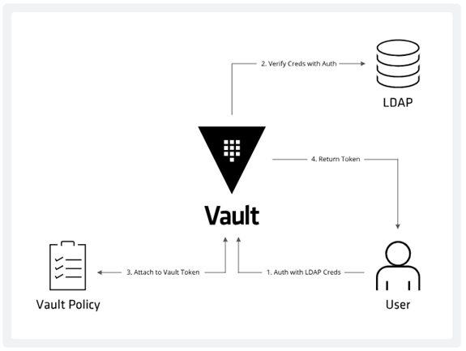

# 1. Overview on Vault Policies

Everything in Vault is path-based, and policies are no exception. Policies provide a declarative way to grant or forbid access to certain paths and operations in Vault. This section discusses policy workflows and syntaxes.

- Provide operator a way to **permit or deny access** to certain paths or actions within Vault (RABC)
- Gives us the ability to **provide granular control** over who gets access to secrets
- Policies are written in **declarative statements** and can be written using **JSON** or **HCL**
- When writting policies, always follow the **principle of least privilege**: give users/applications only permissions they need
- Policies are denied by default (implicit deny), therefore you musy explicitly grant to paths and related capabilities to Vault clients
- Policies are attached to a token. A token can have multiple policies. Policies are cumulative and capabilities are additive
- **Root policy** is created by default: **Superuser** with all permission. 
    - You **cannot** change or delete this policy
    - It is attached to all root tokens
- **Default policy** is created by default: provide common permissions 
    - You **can** change but it cannot be deleted
    - Attached to all non-root tokens by default (can be removed if needed)

# 2. Policy-authorization workflow

<p>
    
</p>

1. A user attempts to authenticate to Vault using their LDAP credentials, providing Vault with their LDAP username and password.
2. Vault establishes a connection to LDAP and asks the LDAP server to verify the given credentials. Assuming this is successful, the LDAP server returns the information about the user, including the OU groups.
3. Vault maps the result from the LDAP server to policies inside Vault using the mapping configured by the security team in the previous section. Vault then generates a token and attaches the matching policies.
4. Vault returns the token to the user. This token has the correct policies assigned, as dictated by the mapping configuration that was setup by the security team in advance.

The user then uses this Vault token for future operations. If the user performs the authentication steps again, they will get a **new token**. The token will have the same permissions, but the **actual token will be different**. Authenticating a second time does not invalidate the original token.

# 3. Managing Vault Policies
## 3.1 Vault Policy Commands

```bash
vault policy <command>
```
`<command>` can be:

- `delete`: deletes a policy by name
- `fmt`: Formats a policy on disk
- `list` : Lists the installed policies
- `read`: Prints the contents of a policy
- `write`: Uploads (create) a named policy from a file

```bash
vault policy write <policy_name> <policy_filename.hcl>
```

## 3.2 Policy Capabilities

Each path must define one or more capabilities which provide fine-grained control over permitted (or denied) operations. Capabilities are always **specified as a list of strings**, even if there is only one capability. To determine the capabilities needed to perform a specific operation, the **-output-policy** flag can be added to the CLI subcommand. 

**The list of capabilities include the following with the associated HTTP verbs in parenthesis :**

- `create` (`POST/PUT`) - Allows creating data at the given path. Very few parts of Vault distinguish between create and update, so most operations require both **create** and **update** capabilities. Parts of Vault that provide such a distinction are noted in documentation.
- `read` (`GET`) - Allows reading the data at the given path.
- `update` (`POST/PUT`) - Allows changing the data at the given path. In most parts of Vault, this implicitly includes the ability to create the initial value at the path.
- `patch` (`PATCH`) - Allows partial updates to the data at a given path.
- `delete` (`DELETE`) - Allows deleting the data at the given path.
- `list` (`LIST`) - Allows listing values at the given path. Note that the keys returned by a list operation are not filtered by policies. Do not encode sensitive information in key names. Not all backends support listing.

**In addition to the standard set, there are some capabilities that do not map to HTTP verbs.**

- `sudo` - Allows access to paths that are root-protected. Tokens are not permitted to interact with these paths unless they have the sudo capability (in addition to the other necessary capabilities for performing an operation against that path, such as read or delete). For example, modifying the audit log backends requires a token with sudo privileges.
- `deny` - Disallows access. This always takes precedence regardless of any other defined capabilities, including sudo.
- `subscribe` - Allows subscribing to events for the given path.
- `recover` - Allows recovering the data on the given path from a snapshot


## 3.3 Anatomy of a Vault policy

Policies are written in HCL or JSON and describe which paths in Vault a user or machine is allowed to access.

```bash
path "<path>" {
    capabilities = ["<list of permissions (capabilities)>"]
}
```

Here is a very simple policy which grants read capabilities to the **KVv1** path **secret/foo**:

```bash
path "secret/foo" {
  capabilities = ["read"]
}
```
When this policy is assigned to a token, the token can read from "secret/foo". However, the token cannot update or delete "secret/foo", since the capabilities do not allow it. Because policies are **deny by default**, the token would have no other access in Vault.

Here is a more detailed policy, and it is documented inline:

```bash
# This section grants all access on "secret/*". further restrictions can be
# applied to this broad policy, as shown below.
path "secret/*" {
  capabilities = ["create", "read", "update", "patch", "delete", "list", "recover"]
}

# Even though we allowed secret/*, this line explicitly denies
# secret/super-secret. this takes precedence.
path "secret/super-secret" {
  capabilities = ["deny"]
}

# Policies can also specify allowed, disallowed, and required parameters. here
# the key "secret/restricted" can only contain "foo" (any value) and "bar" (one
# of "zip" or "zap").
path "secret/restricted" {
  capabilities = ["create"]
  allowed_parameters = {
    "foo" = []
    "bar" = ["zip", "zap"]
  }
}
```

## 3.4 Customizing the path

Policies use path-based matching to test the set of capabilities against a request. A policy path may specify an exact path to match, or it could specify a **glob** pattern which instructs Vault to use a prefix match:

```bash
# Permit reading only "secret/foo". an attached token cannot read "secret/food"
# or "secret/foo/bar".
path "secret/foo" {
  capabilities = ["read"]
}

# Permit reading everything under "secret/bar". an attached token could read
# "secret/bar/zip", "secret/bar/zip/zap", but not "secret/bars/zip".
path "secret/bar/*" {
  capabilities = ["read"]
}

# Permit reading everything prefixed with "zip-". an attached token could read
# "secret/zip-zap" or "secret/zip-zap/zong", but not "secret/zip/zap
path "secret/zip-*" {
  capabilities = ["read"]
}
```

In addition, a **+** can be used to denote any number of characters bounded within a single path segment (this appeared in Vault 1.1):

```bash
# Permit reading the "teamb" path under any top-level path under secret/
path "secret/+/teamb" {
  capabilities = ["read"]
}

# Permit reading secret/foo/bar/teamb, secret/bar/foo/teamb, etc.
path "secret/+/+/teamb" {
  capabilities = ["read"]
}
```

Vault's architecture is similar to a filesystem. Every action in Vault has a corresponding path and capability - even Vault's internal core configuration endpoints live under the "sys/" path. Policies define access to these paths and capabilities, which controls a token's access to credentials in Vault.

## 3.5 Templated policies

The policy syntax allows for doing variable replacement in some policy strings with values available to the token. Currently **identity** information can be injected, and currently the **path** keys in policies allow injection.

<table border="1">
<tr background="grey">
    <td><b>Name</b></td>
    <td><b>Description</b></td>
</tr>
<tr>
    <td>identity.entity.id</td>
    <td>The entity's ID</td>
</tr>
<tr>
    <td>identity.entity.name</td>
    <td>The entity's name</td>
</tr>
<tr>
    <td>identity.entity.metadata.<metadata key></td>
    <td>Metadata associated with the entity for the given key</td>
</tr>
<tr>
    <td>identity.entity.aliases.<mount accessor>.id</td>
    <td>Entity alias ID for the given mount</td>
</tr>
</table>

[Source: Vault Policies Docs](https://developer.hashicorp.com/vault/docs/concepts/policies)

# 4. Testing Policies

Test to make sure the policy fulfills the requirements

**Example**:
- Clients must be able to request AWS credentials granting read access to an S3 bucket
- Read secrest from secret/apikey/Google


1. Create a new token with policy **web-app** attached

```bash
vault token create -policy="web-app"
```

2. List the policies attached to the newly generated token **<token>**

```bash
vault token lookup <token>
```

3. Authenticate with the newly generated token

```bash
vault login <token>
```

4. Make sure that the token can read (Should succeed)

```bash
vault read secret/apikey/Google
```

5. This should fail

```bash
vault wrtite secret/apikey/Google key="123456"
```

6. Request a new AWS Credentials (Should succeed)

```bash
vault read aws/creds/S3-readonly
```

# 5. Administrative Policies

- Permissions for Vault backend functions live at the **sys/** path
- Users/admins will need policies that define what they can do within Vault to administer Vault itself
    - Unsealing
    - Changing policies
    - Adding secret backends
    - Configuring database configurations
