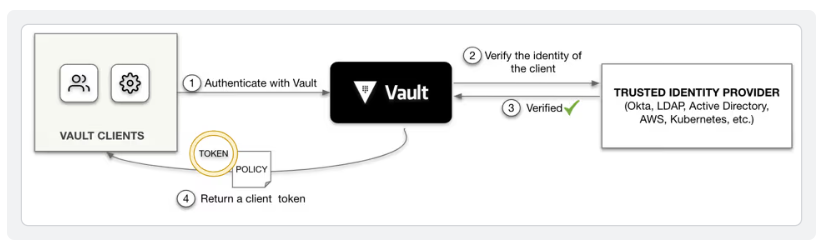
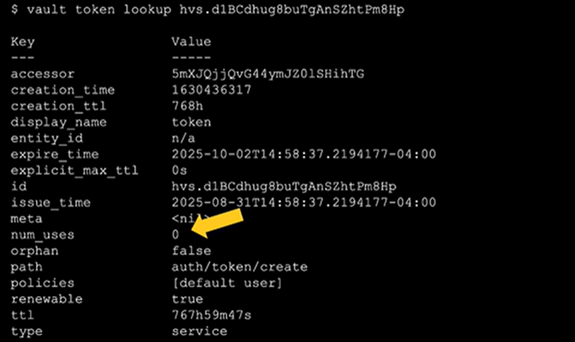
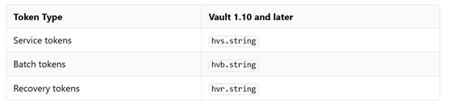

# 1. Introduction to Vault Token

Tokens are the core method for authentication within Vault. Tokens can be used directly or auth methods can be used to dynamically generate tokens based on external identities. Within Vault, tokens map to information. The most important information mapped to a token is a set of one or more attached policies. These policies control what the token holder is allowed to do within Vault. Other mapped information includes metadata that can be viewed and is added to the audit log, such as creation time, last renewal time, and more.

Before a client, either a human or machine, can perform an operation in Vault that client must authenticate to Vault. Upon successful authentication, Vault issues a token from the Vault auth method used to authenticate with the Vault cluster.

# 2. How Vault issues tokens
Alice has selected the userpass and kubernetes auth methods for the HashiCups POC. The userpass auth method acts similar to an identity provider, storing a list of usernames, passwords, and policies assigned to the username. The kubernetes auth method allows Vault to validate a workload managed by Kubernetes against the Kubernetes API.

A client will authenticate against an auth method, and upon successful authentication, Vault will issue a token to the client.

The basic authentication flow is:

<p>
    
</p>


1. A client attempts to authenticate with Vault.
2. Vault verifies the identity with a trusted provider. For the HashiCups POC this would be Vault itself for userpass auth method or the Kubernetes API for the kubernetes auth method.
3. The identity provider validates the Vault client's identity.
4. Vault returns a token to the client.


Regardless of the auth method used, a client must first authenticate with Vault to receive a token.

# 3. Token metadata

Every token includes information about that token. Oliver logs into a Vault dev mode server to learn about the information associated with a root token.

The login information returned includes:

- **Token duration**: How long the token is valid for, typically expressed as the time-to-live (TTL) value in the format of a time string (i.e. "8h" or "30d"). The value is an infinity symbol for a root token because a root token does not have a TTL and can't be renewed, but is valid forever unless you revoke it.
- **Accessor**: A unique ID that can be used to lookup, renew, or revoke a token.
- **Policies**: One or more policies attached to the token that defines the actions authorized to be performed in Vault.
- **Max TTL**
- **Number os Uses Left**
- **Orphaned Token**
- **Renewal Status**

<p>
    
</p>

The **default Vault TTL is 32 days**. You can override the default TTL globally for your Vault cluster, or you can set a specific TTL on a role definition for a specific auth method. You can also set a max TTL which defines how long a token can be renewed for.

In addition to TTL and max TTL, you can set the **number of uses for tokens**. **The tokens with a use limit expire at the end of their last use regardless of their remaining TTLs**. On the same note, **use limit tokens expire at the end of their TTLs regardless of their remaining uses**.

**The root token, shown in the code block above, is the only type of Vault token that can be set to never expire**.

Token accessors are a unique ID that can be used to perform operations on a token such as renewing a token, looking up additional token metadata, or revoking a token. 

# 4. Types of tokens

There are two main types of Vault tokens: **service tokens** and **batch tokens**. Vault persists the service tokens in its storage backend. You can renew a service token or revoke it as necessary.

**Service Token**

- Default token type
- They are persisted to storage (heavy storage read/write)
- Can be **renewed, revoked and create child tokens**
- Mos often, you will be working with service token

**Batch Token**

- They are encrypted Binary Large Objects (blobs)
- Designed to be lightweight and scalable
- They are not persisted to storage but they are not fully-featured
- Ideal for high-volume operations such as encryption
- Can be use for DR replication cluster promotion as well

Vault does not persist batch tokens. Batch tokens are encrypted binary large objects (blobs) that carry enough information to perform Vault actions. This makes batch tokens lightweight and scalable but they lack the flexibility and features of service tokens.

**Token prefix**

Tokens have a prefix that indicates their type.

<p>
    
</p>

# 5. Token lifecycle

**Periodic token**

When having a token be revoked would be problematic. This is useful for long-running services/applications that cannot handle regenrating a token.

- You need to have a root or sudo privileges to create a periodic token (**auth/token/create**)
- Periodic tokens don't have a max TTL but have a TTL
- Periodic tokens may live for an infinite amount of time, so long as they are renwed within their TTL

```bash
vault token create -policy=<policy-attached-to-token> -period=24h
```

**Service Token with Use Limit**

When you want to limit the number of requests coming to Vault from a particular token:

- Limit the token's number of uses in addition to TTL and Max TTL
- Use limit tokens expire at the end of their last use, regardless of their remaining TTLs
- Use limit tokens expire at the end of theirs TTLs, regardless of remaining uses

```bash
vault token create -policy=<policy-attached-to-token> -use-limit=2
```

**Orphan Token**

When the token hierarchy behavior is not desirable:

- Only root tokens or sudo users have the ability to generate to generate orphan tokens (**auth/token/create-orphan**)
- Ophan tokens are not children of their parent token, therefore they do not expire when theur parent token does
- Orphan tokens still expire when their own Max TTL is reached

```bash
vault token create -policy=<policy-attached-to-token> -orphan
```

# 6. Setting the Token Type

- To configure the AppRole auth method to generate batch tokens

```bash
vault auth enable approle
```

```bash
vault write auth/approle/role/training \
    policies="training" \
    token_type="batch" \
    token_ttl="60s"
```

- To configure the AppRole auth method to generate periodic tokens

```bash
vault write auth/approle/role/training \
    policies="jenkins" \
    periodic="72"
```

# 7. Managing Tokens

## 7.1 Managing token using CLI

```bash
vault token <command>
```

`<command>` can be

- **capabilities** - Print capabilities of the token on a path
- **create** - Create a new token
- **lookup** - Display information about a token
- **renew** - Renew a token lease
- **revoke** - Revoke a token and its children

**Create a Token**

```bash
vault token create <options>
```

Some `<options>` for vault token create are:

- -ttl - Initial TTL to associate to the token
- -policy - Name a policy to associate to the token
- -period - Duration of the token
- -orphan - Create the token with no parent
- -type - The type of the token to create
- -use-limit - Number of times this token can be used

Example

```bash
vault token create -ttl=5m -policy=training
```

**Renew a Token**

```bash
vault token renew <token>
```

**Revoke a Token**

```bash
vault token revoke <token>
```

**Look up information about a Token**

```bash
vault token lookup <token>
```

**Look up the capabilities of a Token on a particular path**

```bash
vault token capabilities <token> kv/data/apps/webapp
```

## 7.2 Managing tokens using API

- Authenticate using userpass auth method with API

```bash
curl --request POST \
    --data @userpass_api.json \
    https://127.0.0.1:8200/v1/auth/userpass/login/john | jq

```

- Authenticate and store resulting token in a file

```bash
curl --request POST \
    --data @userpass_api.json \
    https://127.0.0.1:8200/v1/auth/userpass/login/john | jq -r ".auth.client_token" > token.txt

```

```bash
cat token.txt
```

- Authenticate ans store the resulting token in an environment variable

```bash
OUTPUT=$(curl --request POST --data @userpass_api.json https://127.0.0.1:8200/v1/auth/userpass/login/john)
```

```bash
VAULT_TOKEN=$(echo $OUTPUT | jq '.auth.client_token' -j)
```

```bash
echo $VAULT_TOKEN
```

# Documentation

[Vault Documentation](https://developer.hashicorp.com/vault/api-docs/auth/token)

[Kode Cloud Tutorial](https://notes.kodekloud.com/docs/HashiCorp-Certified-Vault-Associate-Certification/Assess-Vault-Tokens/Managing-Tokens-using-the-API)