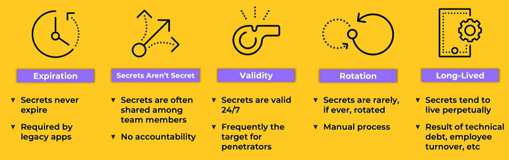
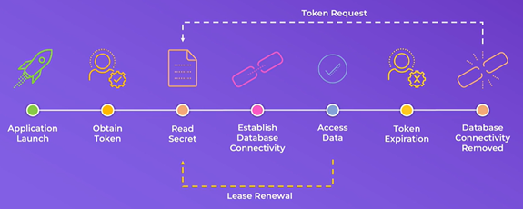
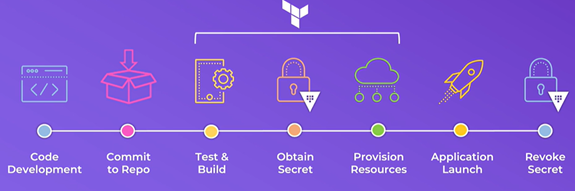
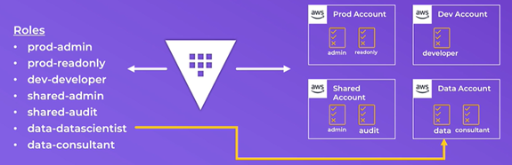
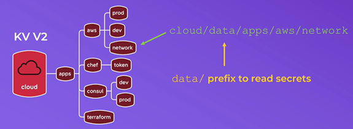
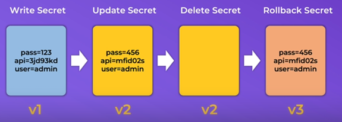

# Vault Secret Engine

<p>
    
</p>

Secrets engines are components which store, generate, or encrypt data. Secrets engines are incredibly flexible, so it is easiest to think about them in terms of their function. Secrets engines are provided some set of data, they take some action on that data, and they return a result.

Some secrets engines simply store and read data - like encrypted Redis/Memcached. Other secrets engines connect to other services and generate dynamic credentials on demand. Other secrets engines provide encryption as a service, totp generation, certificates, and much more.

Secrets engines are enabled at a path in Vault. When a request comes to Vault, the router automatically routes anything with the route prefix to the secrets engine. In this way, each secrets engine defines its own paths and properties. To the user, secrets engines behave similar to a virtual filesystem, supporting operations like read, write, and delete.

# 1. Dynamic vs Static Secrets

Vault will store any secret in a secure manner. The secrets may be SSL certificates and keys for your organization's domain, credentials to connect to a corporate database server, etc. Storing such sensitive information in plaintext is not desirable or secure so Vault secure stores and provides retrieval mechanisms.

The KV secrets engine is the most commonly used engine for static secrets. In addition to offering **static secrets** through the kv secrets engine, Vault can generate **dynamic secrets**. Dynamic secrets do not exist until read, so the risk of being stolen is greatly reduced. Because Vault has built-in revocation mechanisms, Vault revokes dynamic secrets after use thereby minimizing the amount of time the secret existed.

## Why You SHould Use Dynamic Secrets

- **Create Secretes On-demand** - Easily generate secrets when you need them
- **Associated Lease**s - Each secret has an associated lease
- **Validity Period** - Each leases determines when and how a secret expires
- **Technical Debt Solved** - Secret is revoked in both Vault and at the origin
- **Renewal** - Control if a secret.token can be renewed with granularity
- **Revocation** - Allow secrets to expire automatically or manually revoke required

Some example where dynamic secrets are used:

- CI/CD pipeline, Access to Public, Cloud Environment
- Database Credentials for APplications
- ELevated Account for Vulnerability SCanning
- Privileged Access Foe Administrators

## Examples of Applications using Vault

**1. Application wants to Reading/Wirte data in a the Database Server**

<p>
    
</p>

- the application launches
- The application connects to Vault and obtains et token
- The applications reads/get the Secrets (credentials) to connect to the database
- The application gets access to the Database
- The token expires thereafter and the connectivity with the Database is lost
- The application can request a new token or renew the token

**2. CI/CD Pipeline deployment**
<p>
    
</p>

- A code is deployed and committed from a git repo and tested
- The pipeline connects to Vault to request a token
- The pipeline obtains a token and resources are provisionned
- The new application is deployed or launched
- Then the token is revoked

# 2. Vault Secrets Engines

- Secrets engines are components that can **store**, **generate**, or **encrypt** data
    - Many secrets engines can be enabled in Vault
    - You can enable *multiple* instances of the same secrets engine
    - Secrets engines are **plugins** that extend the finctionality of Vaule
- Secrets engines are **enabled and isolated at at path**
    - All interventions with the secrets engine are done using path
    - **Path must be unique**
    - Paths do not need to match the secrets engines or type, make them meaningfull for you and your organization
- Cubbyhole and Identity are enabled by default (can't be disabled or deleted)
- Any other secrets engine must be enabled
    - Can enable using the CLI, API or UI (most)

**1. What is the secret**

A secret is everything an organization deems sennsitive within their organization
- Username & Password
- TLS certificate - Private key & Cert
- API Key
- Database Credentials
- Application Data
- Anything else you don't want to store in plaint-text

**2. Secrets as a Service**

- Use Vault to generate and manage the lifecycle of credentials on demand
- No more sharing credentials
    - Credentials get revoked autmatically at the end of the lease
    - Audit trail can identify points of compromise
- Use policies to control the access based on the client's role

**3. Secrets Engines - Responsabilities**

**- Privileged User (Vault Admin, Security Team)**

    - Enable the secrets Engine
    - Configure the connection to the backend platform (AWS, Database, etc)
    - Create roles that define permissions to the backend platform
    - Create policies that grant permission to read from the secrets engine

**- Vault Clients (Users, Apps, Services, Machines, etc)**

    - Read a set of credentials using a token and the associated policy
    - Renew the lease before its expiration of needed (or pemitted)
    - Renew the token if needded (or permitted)

# 3. Working with a Secrets Engine

Use the Vault Secrets commands

```bash
vault secrets <commands>
```

`<command>` can be:

- `disable` - Disable a secret engine
- `enable` - Enable a secret engine
- `list` - List enabled secrets engines
- `move` - Move a secrets engine to a new path
- `tune` - Tune a secrets engine configuration

**Example**

```bash
vault secrets enable aws
```

```bash
vault secrets enable -path=developers kv
```

```bash
vault secrets enable -description="My First kv" -path="cloud-kv" kv-v2
```

```bash
vault secrets tune -default-lease-tll=72h pki/
```

```bash
vault secrets list -detailed
```

# 4. Configuring a Secrets Engine for dynamic Credentials

There are genrally 02 steps when configuring a secrets engine that will generate dynamic credentials:
1. Configure Vault with access to the platform
2. Configure Roles Based on permissions needed

Vault does not know what persmissions, groups and policies you want to attach to generated credentials (tokens). Each role maps to a set of permissions on the targeted platform.

**Example**:
Roles in AWS:
- Read Only
- Full Admin
- Read S3
- Write S3
- List EC2
- Create RDS

<p>
    
</p>

Organizations usually have Multiple AWS accounts. What we need to do it's create a role based on the permissions we need inside of each those accounts. 
- Create a policy for the permission
- Create a Role and attach the policy to the role
- Attach the policy to the user or group, or attach the role to an instance or apps

## 4.1 Configure Vault Access to AWS 
### 4.1.1 Configure Vault Access to AWS using IAM Role credential type

**a. Enabling the AWS Secret Engine** 

```bash
vault secrets enable -description="Access to AWS Platform" -path="aws-cloud" aws
```

**b. Configure the credentials**

```bash
vault write aws-cloud/config/root \
    access_key=<aws_access_key> \
    secret_key=<aws_secret_key> \
    region=<aws_region>
    sts_region=<aws_region> \
    sts_endpoint="https://sts.<aws_region>.amazonaws.com"
```

**c. Configuring Roles Based on permission for AWS**

- Policy attached to the user vault_user in AWS

The user vault_user must all required permission to IAM user on AWS. Below is the policy called `VaultPermissionsIAM` that have been created on AWS and attached to the user vault_user.

```bash
{
  "Version": "2012-10-17",
  "Statement": [
    {
      "Effect": "Allow",
      "Action": [
        "iam:AttachUserPolicy",
        "iam:CreateAccessKey",
        "iam:CreateUser",
        "iam:DeleteAccessKey",
        "iam:DeleteUser",
        "iam:DeleteUserPolicy",
        "iam:DetachUserPolicy",
        "iam:GetUser",
        "iam:ListAccessKeys",
        "iam:ListAttachedUserPolicies",
        "iam:ListGroupsForUser",
        "iam:ListUserPolicies",
        "iam:PutUserPolicy",
        "iam:AddUserToGroup",
        "iam:RemoveUserFromGroup",
        "iam:TagUser"
      ],
      "Resource": ["arn:aws:iam::ACCOUNT-ID-WITHOUT-HYPHENS:user/vault_*"]
    }
  ]
}
```

- Create in AWS a ReadOnly policy called `AmazonEC2ReadOnlyAccess` for the role. The json policy looks like:

```bash
{
    "Version": "2012-10-17",
    "Statement": [
        {
            "Effect": "Allow",
            "Action": [
                "ec2:Describe*",
                "ec2:GetSecurityGroupsForVpc"
            ],
            "Resource": "*"
        },
        {
            "Effect": "Allow",
            "Action": "elasticloadbalancing:Describe*",
            "Resource": "*"
        },
        {
            "Effect": "Allow",
            "Action": [
                "cloudwatch:ListMetrics",
                "cloudwatch:GetMetricStatistics",
                "cloudwatch:Describe*"
            ],
            "Resource": "*"
        },
        {
            "Effect": "Allow",
            "Action": "autoscaling:Describe*",
            "Resource": "*"
        }
    ]
}
```

- Using arn of the policy AmazonEC2ReadOnlyAccess to create the role

```bash
vault write aws-cloud/roles/vault_user \
    credential_type=iam_user \
    policy_arns=arn:aws:iam::aws:policy/AmazonEC2ReadOnlyAccess
```

**d. Generate a new credential by reading from the `/creds` endpoint with the name of the role**

Now you can create new credentials using the below command

```bash
vault read aws-cloud/creds/vault_user
```

Each invocation of the command will generate a new credential.

Unfortunately, IAM credentials are eventually consistent with respect to other Amazon services. If you are planning on using these credential in a pipeline, you may need to add a delay of 5-10 seconds (or more) after fetching credentials before they can be used successfully.

If you want to be able to use credentials without the wait, consider using the STS method of fetching keys. IAM credentials supported by an STS token are available for use as soon as they are generated.

**e. Rotate the credentials that Vault uses to communicate with AWS**

You can no rotate the key (AWS ACCESS_KEY) by using the command below

```bash
vault write -f aws-cloud/config/rotate-root
```


### 4.1.2 Configure Vault to AWS using Assume Role credential type

Enable cross account access from the account where Vault lives to another account. When we get credentials we want to get credentials for the other account. We will use Vault to create the credential and pass it back to the user.

**a. Enabling AWS Secrets Engine**

```bash
vault secrets enable -description="AWS Using Assume Role" -path=aws-ar aws
```
 
## 4.2 Configure Vault Access to Database (MySQL) 
### 4.2.1 Configuring access to MySQL

- Enabling MySQL Secrets Engine
```bash
vault secrets enable -description="Access to Databases" database
```

- Configuring MySQL access

```bash
vault write database/config/mysql-database \
    plugin_name=mysql-database-plugin \
    connection_url="{{username}}:{{password}}@tcp(127.0.0.1:3306)/" \
    allowed_roles="mysql-role" \
    username="vaultuser" \
    password="vaultpass"
```

### 4.2.2 Configuring Roles Based on permission for Database (MySQL)

1. Configure a role that maps a name in Vault to an SQL statement to execute to create the database credential

```bash
vault write database/roles/mysql-role \
    db_name=mysql-database \
    creation_statements="CREATE USER '{{name}}'@'%' IDENTIFIED BY '{{password}}';GRANT SELECT ON *.* TO '{{name}}'@'%';" \
    default_ttl="1h" \
    max_ttl="24h"
```

2. Generate a new credential by reading from the /creds endpoint with the name of the role

```bash
vault read database/creds/mysql-role
```

# 4.3 Cleaning

- For only one user created

```bash
vault lease revoke <lease_id>
```

```bash
vault lease revoke aws-cloud/creds/vault_user/O8Ec6yKxC0T4LDr8j6TMWs9g
```

- For all users created under the role vault_user

```bash
vault lease revoke -prefix aws-cloud/creds/vault_user
```

# 5. KV secrets engine

The kv secrets engine is a generic **key-value** store used to store arbitrary secrets within the configured physical storage for Vault. This secrets engine can run in one of two modes; store a single value for a key, or store a number of versions for each key and maintain the record of them.

The Key/vamue secrets engine is used to **store static secrets**

- There are two versions: **v2(Kv-v2) is versioned but v1(v1) is not**
- Secrets are accessible via UI, CLI and API - Interactve or automated
- Access to KV paths is enforced via **policies (ACLs)**

KV Secrets Engines is the most frequently used in Vault. Like everything else in Vault, secrets written to the KV secrest engine are **encrypted** using 256-Bit AES.

Key/value secrets engine can be **enbaled at different paths**. 

- Each Key/Value secrets engine is **isolated** and **unique**

Secrets are stored as key-value pairs at a defined **path** (ex. secret/apps/web01)

- Writing a new secret will **replace the old value**
- Writing a new secret requires the **create capability**
- Updating/overwriting a secret to an existing path requires **update capability**

When you run Vault in **-dev server** mode, Vault enables a KV v2 secrest engine at the **secret/** path, by default.

**How is KV v2 Different ?**

- To support versioning, KV v2 adds metatdata to our Key Value entries
- Used to determine creation date, the version of the secret, etc

<p>
    
</p>

Introduces 02 prefixes that must be accounted for when referencing secrets and/or metadata

- **cloud/data** - data where the actual K/V data is stored
- **cloud/metadata** - the metadata prefix stores our metadata about a secret
- The **data/** and **metadata/** prefix is **required** for accessing the the API and when writing Vault policies
- It does **NOT** change the way you interact with the KV store when using the CLI


**Versioning in KV v2**

<p>
    
</p>

- You create the first time the secret, this is the first version of the secret (v1)
- When you do update the secret, a new version of the secret is created (v2), but v1 still exists
- When you delete the v2, you are still on v2 but Vault will provide you empty data
- When ask for the rollback, a new version is created which is v3 with the content of the data on v2
- Instead of rollback, to do undelete, Vault will not create a new version but keep the last one 
- When you do destroy, the version remain but the data are completed erased but we can still write in the path

# 6. Working with KV Secrets Engine

## 6.1 Managing KV Secrets Engine

### Using Command Line (CLI)

```bash
vault kv <commands>
```

`<commands>` can be:

- `put` - Write data to the KV
- `get` - Read data from the KV
- `delete` - Delete data from the KV
- `list` - List data within the KV (paths)
- `undelete` - Undelete version of secret (only for KV v2)
- `destroy` - Permanently destroy data (only for KV v2)
- `patch` - Add a specific key in the KV (only for KV v2)
- `rollback` - Recover old data in the KV (only for KV v2)

**KV Version 1**

```bash
vault secrets enable -path=kv1 -version=1 kv
```

```bash
vault kv <commands> kv1/<key_path>
```

**KV Version 2**

```bash
vault secrets enable -path=kv2 -version=2 kv
```

```bash
vault kv <commands> kv2/<key_path>
```

### Using API

**KV Version 1**

```bash
curl \
    --header "X-Vault-Token: ..." \
    https://127.0.0.1:8200/v1/secret/config
```

**KV Version 2**

Note that **data/** or **metadata/** must be used here.

To create a Secret

```bash
{
  "options": {
    "cas": 0
  },
  "data": {
    "foo": "bar",
    "zip": "zap"
  }
}
```

```bash
curl \
    --header "X-Vault-Token: ..." \
    --request POST \
    --data @payload.json \
    https://127.0.0.1:8200/v1/secret/data/my-secret
```

To read the secret of a specific version

```bash
curl \
    --header "X-Vault-Token: ..." \
    https://127.0.0.1:8200/v1/secret/data/my-secret?version=2
```

Delete latest version of secret

```bash
curl \
    --header "X-Vault-Token: ..." \
    --request DELETE \
    https://127.0.0.1:8200/v1/secret/data/my-secret
```

Delete secret versions

```bash
{
  "versions": [1, 2]
}
```

```bash
curl \
    --header "X-Vault-Token: ..." \
    --request POST \
    --data @payload.json \
    https://127.0.0.1:8200/v1/secret/delete/my-secret
```

# 7. Cubbyhole Secrets Engine

Cubbyhole Secret Engine is used to store arbitrary secrets
- Enabled by default at the cubbyhole/ path
- Its lifetime is linked to the token used to xrite the data
    - No ceoncept of a time-to-live (TTL) or refresh interval for values in Cubbyhole
    - Even the root token cannot read the data if it wasn't wrtitten by the root
- Cubbyhole Secrets Engine cannot be disabled, moved or enabled multiple times

## 7.1 Writing and Reading Data to Cubbyhole 

### Using CLI

```bash
vault write cubbyhole/training certification=associate
```

```bash
vault read cubbyhole/training 
```

### Using API

```bash
curl \
    --header "X-Vault-Token: ..." \
    --request POST \
    --data '{"certification": "associate"}' \
    http://127.0.0.1:8200/v1/cubbyhole/my-secret

```

```bash
curl \
    --header "X-Vault-Token: ..." \
    http://127.0.0.1:8200/v1/cubbyhole/my-secret 
```

## 7.2 Cubbyhole Response Wrapping

Instead of sending secrets over the network, you can use cubbyhole's **Response wrapping** feature.

- Enables the retrieval of secrets from a path and Vault will store them inside of another token's cubbyhole
    - This token is called the **wrapping token**
    - The wrapping token is **temporary** and limited by a TTL
    - It is also a **single-use token**

- The wrapping token can be sent across the network and the user can unwrap the token to retrieve the real data (secrets).

**Benefits of Response Wrapping**

- **Privacy** by ensuring that any secret translitted across the network is not the actual secret
- **Malfeansance detection** by ensuring that only a single party can unwrap the token and gain access to the secrets (because it's a single-use token)
- **Limitation** of the lifetime of the secret exposure because the wrapping token has a defined TTL

**Create a Response Wrapping - wrapping token**

```bash
vault kv get -wrap-ttl=5m secrets/certification/associate
```

**Unwrap the secret**

```bash
vault unwrap <wrapping-token>
```


# 8. Transit Secrets Engine

## 8.1 Overview

The transit secrets engine handles cryptographic functions on data in-transit. Vault doesn't store the data sent to the secrets engine. It can also be viewed as "cryptography as a service" or "encryption as a service". The transit secrets engine can also sign and verify data; generate hashes and HMACs of data; and act as a source of random bytes.

- Provides function for encrypting/decrypting data - enables organizations to outsource/centralize encryption to Vault
- Application can send cleartext data to Vault for encryption
    - Vault encrypts using the specific key and return the ciphertext to the application
    - The application NEVER has access to the encryption key (stored in Vault)
- Decouples storage from encryption and access control

**Note:**

**Transit Secrets Engine does not store the Encrypted Data.**

## 8.2 Encrypting Data

Encryption keys are **created and stores in Vault** to process data
- Each application can have its own encryption key (or more)
- Apps must have permission to use the key for encryption/decryption operations, which is bound by the policy attached to its token

Keys can be **easily rotated** as often as needed
- Keys are stored on keyring
- Van limit what version(s) of keys can be used for decryption
- You can **create**, **rotate**, **delete** and **export** a key (need permissions)
- Easily rewrap ciphertext with a newer version of a key

Vault also supports **convergent encryption** mode
- Means that every time you encrypt the same data, you will get the same ciphertext
- This enables you to have searchable ciphertext

Encrypting Data
- All plaintext data must be **base64-encoded**
- This is because Vault doesn't require that the plaintext is "texté only. It could be a file such a PDF or image
- But .. pleae understand that base64-encoding is NOT encryption

## 8.3 Working with the Transit Secrets Engine

Most secrets engines must be configured in advance before they can perform their functions. These steps are usually completed by an operator or configuration management tool.

### 1. Enable the Transit secrets engine:

```bash
vault secrets enable transit
```

By default, the secrets engine will mount at the name of the engine. To enable the secrets engine at a different path, use the **-path** argument.

### 1. Create a named encryption key:

```bash
vault write -f transit/keys/my-key # Using default key type
```

```bash
vault write -f transit/keys/my-key_rsa type="rsa-4096" # Using a custom key 
```

### 2. Encrypt some plaintext data using the `/encrypt` endpoint with a named key

```bash
vault write transit/encrypt/my-key plaintext=$(echo "my secret data" | base64)
```

Or

```bash
vault write transit/encrypt/my-key plaintext=$(base64 <<< "my secret data")
```

As a result we have:

`ciphertext    vault:v1:8SDd3WHDOjf7mq69CyCqYjBXAiQQAVZRkFM13ok481zoCmHnSeDX9vyf7w==`

The returned ciphertext starts with `vault:v1:`. The first prefix (**vault**) identifies that it has been wrapped by Vault. The **v1** indicates the key version 1 was used to encrypt the plaintext; therefore, when you rotate keys, Vault knows which version to use for decryption. The rest is a base64 concatenation of the initialization vector (IV) and ciphertext.

Note that Vault does not store any of this data. The caller is responsible for storing the encrypted ciphertext. When the caller wants the plaintext, it must provide the ciphertext back to Vault to decrypt the value.

### 3. Decrypt a piece of data using the `/decrypt` endpoint with a named key

```bash
vault write transit/decrypt/my-key ciphertext=vault:v1:8SDd3WHDOjf7mq69CyCqYjBXAiQQAVZRkFM13ok481zoCmHnSeDX9vyf7w==
```

As a result we have:

`plaintext    bXkgc2VjcmV0IGRhdGEK`

The resulting data is base64-encoded (see the note above for details on why). Decode it to get the raw plaintext:

```bash
base64 --decode <<< "bXkgc2VjcmV0IGRhdGEK"
```

It is also possible to script this decryption using some clever shell scripting in one command:

```bash
vault write -field=plaintext transit/decrypt/my-key ciphertext=... | base64 --decode
```

### 4. Rotate the underlying encryption key. 

This will generate a new encryption key and add it to the keyring for the named key:

```bash
vault write -f transit/keys/my-key/rotate
```

Future encryptions will use this new key. Old data can still be decrypted due to the use of a key ring.

### 5. Upgrade already-encrypted data to a new key. 

Vault will decrypt the value using the appropriate key in the keyring and then encrypt the resulting plaintext with the newest key in the keyring.

```bash
vault write transit/rewrap/my-key ciphertext=vault:v1:8SDd3WHDOjf7mq69CyCqYjBXAiQQAVZRkFM13ok481zoCmHnSeDX9vyf7w==
```
As a result we have:

`ciphertext      vault:v2:0VHTTBb2EyyNYHsa3XiXsvXOQSLKulH+NqS4eRZdtc2TwQCxqJ7PUipvqQ==`


This process **does not** reveal the plaintext data. As such, a Vault policy could grant almost an untrusted process the ability to "rewrap" encrypted data, since the process would not be able to get access to the plaintext data.

# 9. Vault PKI Secrets Engine

We will set up a root CA, create an intermediate CA, and generate certificates for services using both direct CLI output and file-based methods.

## Step 1: Enable the PKI Secrets Engine

1. First, enable a PKI secrets engine for the root CA:

```bash
vault secrets enable -path=pki_root pki
```

2. Configure the maximum lease TTL to 10 years:

```bash
vault secrets tune -max-lease-ttl=87600h pki_root
```

## Step 2: Generate Root CA

1. Generate and view the root certificate directly in the CLI:

```bash
vault write pki_root/root/generate/internal \
    common_name="Lab Root CA" \
    ttl=87600h
```

2. Generate it again but save to a file for later use:

```bash
vault write -format=json pki_root/root/generate/internal \
    common_name="Lab Root CA" \
    ttl=87600h > root_ca.json
```

3. Configure the CA and CRL URLs:

```bash
vault write pki_root/config/urls \
    issuing_certificates="http://vault.lab:8200/v1/pki_root/ca" \
    crl_distribution_points="http://vault.lab:8200/v1/pki_root/crl"
```

## Step 3: Create Intermediate CA

1. Enable a PKI secrets engine for the intermediate CA:

```bash
vault secrets enable -path=pki_int pki
```

2. Set a shorter max TTL for the intermediate CA (5 years):

```bash
vault secrets tune -max-lease-ttl=43800h pki_int
```

3. Generate and view the intermediate CSR directly:

```bash
vault write pki_int/intermediate/generate/internal \
    common_name="Lab Intermediate CA" \
    ttl=43800h
```

4. Generate it again and save to a file:

```bash
vault write -format=json pki_int/intermediate/generate/internal \
    common_name="Lab Intermediate CA" \
    ttl=43800h > intermediate.json
```

```bash
cat intermediate.json | jq -r .data.csr > intermediate.csr
```

5. Sign the intermediate CSR with the root CA and save to a file:

```bash
vault write -format=json pki_root/root/sign-intermediate \
    csr=@intermediate.csr \
    format=pem_bundle \
    ttl=43800h > signed_intermediate.json
```

```bash
cat signed_intermediate.json | jq -r .data.certificate > signed_intermediate.pem
```

6. Import the signed certificate back into the Vault Intermediate:

```bash
vault write pki_int/intermediate/set-signed \
    certificate=@signed_intermediate.pem
```

## Step 4: Create a Role for Issuing Certificates

1. Create a role for issuing certificates for a webapp:

```bash
vault write pki_int/roles/webapp \
    allowed_domains="lab.local" \
    allow_subdomains=true \
    max_ttl=720h \
    key_type="rsa" \
    key_bits=2048 \
    allowed_uri_sans="dns://lab.local" \
    require_cn=true \
    basic_constraints_valid_for_non_ca=true
```

## Step 5: Generate a Certificate for the webapp:

1. Generate and view a certificate directly in the CLI:

```bash
vault write pki_int/issue/webapp \
    common_name="webapp.lab.local" \
    ttl=72h
```

This will display:

- The certificate
- The private key (Vault will only output the private key once)
- CA chain
- Serial number
- Other metadata

2. Issue a certificate and save it to files (useful for deploying to services):

```bash
vault write -format=json pki_int/issue/webapp \
    common_name="webapp.lab.local" \
    ttl=72h > webapp_cert.json
```

- Extract each component to its own file

```bash
cat webapp_cert.json | jq -r .data.certificate > webapp_cert.pem
cat webapp_cert.json | jq -r .data.private_key > webapp_key.pem
cat webapp_cert.json | jq -r .data.ca_chain[] > webapp_ca_chain.pem
```

- [Optional] View each file to see the contents

```bash
cat webapp_cert.pem
cat webapp_key.pem
cat webapp_ca_chain.pem
```

## Step 6: Verify the Certificate

1. View the certificate details:

```bash
# For the CLI-generated certificate, copy the certificate content to a file first
# For the file-based certificate:
openssl x509 -in webapp_cert.pem -text -noout
```

## Step 7: Working with Certificate Revocation

1. View a certificate's serial number:

```bash
# Directly from CLI output when generating
vault write pki_int/issue/webapp common_name="temp.lab.local" ttl=72h

# Or from a saved certificate
openssl x509 -in webapp_cert.pem -noout -serial
```

2. Revoke a certificate:

```bash
vault write pki_int/revoke \
    serial_number=<serial_number_from_certificate>
```

3. Generate a new CRL:

```bash
vault write pki_int/config/urls \
    issuing_certificates="http://vault.lab:8200/v1/pki_int/ca" \
    crl_distribution_points="http://vault.lab:8200/v1/pki_int/crl"
```

## Create a Vault Policy for the Application named webapp to Generate a PKI Certificate

1. Create a new file named `webapp-policy.hcl`

**Right-click** in the left navigation pane or use the command `touch webapp-policy.hcl`

```bash
# Permit reading the configured certificates
path "pki_int/cert/*" {
    capabilities = ["read", "list"]
}

# Permit creating certificates from the webapp role
path "pki_int/issue/webapp" {
    capabilities = ["create", "update"]
}

# Allow reading the CRL and CA certificate
path "pki_int/cert/ca" {
    capabilities = ["read"]
}

path "pki_int/cert/crl" {
    capabilities = ["read"]
}
```

2. Write the policy to Vault:

```bash
vault policy write policy-webapp-pki webapp-policy.hcl
```

Note: In production, you would most likely attach this policy to your webapp's authentication role to give it the authorization to generate certificates (among other permissions it might need).

[Documentation on Vault PKI](https://github.com/btkrausen/vault-codespaces/blob/main/labs/lab_pki_secrets_engine.md)


