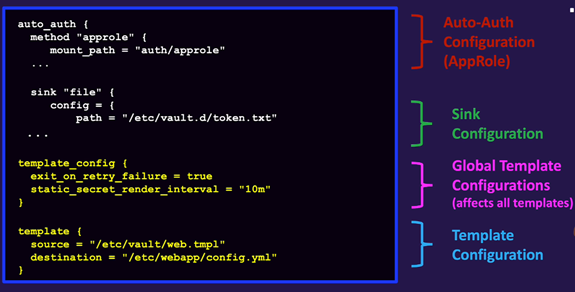

# Vault Agent

# Introduction

Vault Agent aims to remove the initial hurdle to adopt Vault by providing a more scalable and simpler way for applications to integrate with Vault, by providing the ability to render templates containing the secrets required by your application, without requiring changes to your application.

Vault Agent is a client daemon that provides the following features:

- **Auto-auth** - Automatically authenticate to Vault and manage the token renewal process for locally-retrieved dynamic secrets.
- **API proxy (deprecated)** - Allows Vault Agent to act as a proxy for Vault's API. This feature has been deprected from Vault Agent. Use Vault Proxy as a Vault API proxy.
- **Caching** - Allows client-side caching of responses containing newly created tokens and responses containing leased secrets generated off of these newly created tokens. The agent also manages the renewals of the cached tokens and leases.
- **Windows Service** - Allows running the Vault Agent as a Windows service.
- **Templating** - Allows rendering of user-supplied templates by Vault Agent, using the token generated by the auto-auth step.
- **Process Supervisor Mode** - Runs a child process with Vault secrets injected as environment variables.

# Vault Agent - `Auto Auth`

Vault Agent’s Auto-Auth feature automates authentication to Vault and manages token renewal, removing the need for applications to handle Vault login logic directly. It works by using an **auth method** to obtain a token and writing it to a **sink** for applications to consume.

- The vault Agent uses a **pre-defined auth** method to authenticate to Vault and obtain a token
- The token is stored in the **`sink`** which is essentially just a flat file on a local file system that contains Vault token
- The application can read this token and invoke the Vault API directly
- This strategy allows the Vault Agent to **manage the token** and guarantee that a valid token is always available to the application

Auth methods are generally the methods you had associated with **`machine-oriented`** auth methods (AliCloud, AWS, AppRole, Kubernetes, GCP, Kerberos, Azure, CloudFOundary, Certificate, JWT)

```bash
# Auto Auth Configuration (AppRole)
auto_auth {
 method "approle" {
   mount_path = "auth/approle" # AppRole Auth Method is used here
   config = {
     role_id_file_path = "/etc/vault/roleid" # Path to the RoleID
     secret_id_file_path = "/etc/vault/secretid" # Path to the SecretID
   }
 }

 # Sink configuration
 sink "file" {
   config = {
     path = "/etc/vault/token.txt" # Path where the token will be stored
     mode = 0640
   }
 }
}

# Vault cluster address and configurations
vault {
 address = "http://127.0.0.1:8200" # Cluster IP Adress and Port
}
```

**Advanced Features**

- **Response Wrapping**: At Method: Protects against MITM by returning a wrapped token, but prevents auto-renewal. At Sink: Allows renewal but token travels in cleartext between Vault and Agent.
- **Token Encryption**: Experimental feature using Diffie-Hellman + AES-GCM for forward secrecy.
- **Re-auth on New Credentials**: For supported methods (AWS, GCP, Cert, JWT, LDAP, OCI), Agent can re-authenticate when credentials change.


# Vault Agent - `Sink`

For now, file is the only supported method of storing the auto-auth token.
Common configuration parameters include:

- **type** - What type of sink to use 
- **path** - Location on the file
- **mode** - change the file permission of the sink (640 is the default)
- **wrap_ttl** - retrieve the token using response wrapping

# Response wrapping and the sink

**Best Practices**

- Use method wrapping for maximum network security when renewal is not required.
- Use sink wrapping when renewal is essential.
- Protect sink files with strict permissions.
- Always run Vault Agent with TLS to secure token transit.

This setup is ideal for legacy apps—they simply read the token from the sink without implementing Vault authentication logic.

<table>
<tr>
    <td><b>Element</b></td>
    <td><b>Response Wrapped by the Auth Method</b></td>
    <td><b>Response Wrapped by the Sink</b></td>
</tr>
<tr>
    <td><b>Pros</b></td>
    <td>
      <ul>
        <li>Prevents man-in-the-middle attacks (MITM)</li>
        <li>More secure</li>
      </ul>
    </td>
    <td>
      <ul>
        <li>Allows the Vault Agent to renew the token and re-authenticate when the token expires</li>
      </ul>
    </td>
</tr>
<tr>
    <td><b>Cons</b></td>
    <td>
      <ul>
        <li>Vault Agent cannot renew the token</li>
      </ul>
    </td>
    <td>
      <ul>
        <li>The token gets wrapped fter it is retrieved from Vault. Therefore, it is vulnerable to a MITM attack</li>
      </ul>
    </td>
</tr>
</table>


# Vault Agent - `Templating`

Vault Agent's Template functionality allows Vault secrets to be rendered to files or environment variables (via the Process Supervisor Mode) using **Consul Template markup**. 

When the Agent is started with templating enabled, it will attempt to acquire a Vault token using the configured auto-auth Method. On failure, it will back off for a short while (including some randomness to help prevent thundering herd scenarios) and retry. On success, secrets defined in the templates will be retrieved from Vault and rendered locally.

**Consul Template workflow**

- step1: Create a template file that specifies the path and data you want
- Step2: Execute Consul Template. Consul template retrieves data and renders to destination file
- step3: The application reads the new file at runtime that includes secrets retrieved from vault.

**Exemple of Consul Template file**

- Consul Template to retrieve Database credentials

```bash
production:
  adapter: postgresql
  encoding: unicode
  database: orders
  host: postgres.jdtech.com
  {{ with secret "database/creds/readonly" }}
  username: "{{ .Data.username }}"
  password: "{{ .Data.password }}"
  {{ end }}
  ```

- Consul Template that retrieves a generic secret from Vault's KV store:

```bash
{{ with secret "secret/my-secret" }}
{{ .Data.data.foo }}
{{ end }}
```

- Consul template that issues a PKI certificate in Vault's PKI secrets engine. The fetching of the certificate or key from a PKI role through this function will be based on the certificate's expiration.

To generate a new certificate and create a bundle with the key, certificate, and CA, use:

```bash
{{ with pkiCert "pki/issue/my-domain-dot-com" "common_name=foo.example.com" }}
{{ .Data.Key }}
{{ .Data.Cert }}
{{ .Data.CA }}
{{ end }}
```

To fetch only the issuing CA for this mount, use:
```bash
{{- with secret "pki/cert/ca" -}}
{{ .Data.certificate }}
{{- end -}}
```

<p>
    
</p>

# Templating for vault agent to connect on the mysql server

Configuring a Vault Agent with templating to connect to a MySQL server involves a few steps. You'll typically use the Vault Agent to handle authentication and secret management so that your applications can retrieve database credentials dynamically.

**Step 1: Enable the Database Secrets Engine**

First, you need to enable the database secrets engine in Vault and configure it to connect to your MySQL database.

- Enable the MySQL secrets engine:

```bash
vault secrets enable database
```

- Configure the MySQL connection:

Replace username, password, hostname, and dbname with your actual database connection details.

```bash
vault write database/config/my-mysql-database \
    plugin_name=mysql-database-plugin \
    allowed_roles="my-role" \
    connection_url="{{username}}:{{password}}@tcp(127.0.0.1:3306)/dbname" \
    username="your-database-username" \
    password="your-database-password"
```

**Step 2: Create a Role for Dynamic Credentials**

Next, create a role that defines the permissions and how dynamic credentials should be generated.

```bash
vault write database/roles/my-role \
    db_name=my-mysql-database \
    creation_statements="CREATE TABLE IF NOT EXISTS test (id INT AUTO_INCREMENT PRIMARY KEY, name VARCHAR(255))" \
    default_ttl="1h" \
    max_ttl="2h"
```

***Step 3: Configure Vault Agent with Templating***

To set up the Vault Agent, you’ll need to create a configuration file. Below is an example of how to configure the Vault Agent to generate and manage database credentials.

- Create a configuration file (e.g., vault-agent.hcl):

```bash
# vault-agent.hcl

# Configure the Vault Agent
pid_file = "./vault-agent.pid"

auto_auth {
  method "approle" {
    config {
      role_id   = "your-role-id"
      secret_id = "your-secret-id"
    }
  }

  # Optional: configure a cache for the token to reduce the number of requests to Vault
  cache {
    use_auto_auth_token = true
  }
}

# Template configuration for rendering database credentials
template {
  source      = "./db-template.ctmpl"
  destination = "./db-credentials.json"
  contents    = <<EOH
{
  "username": "{{ .Data.username }}",
  "password": "{{ .Data.password }}"
}
EOH
}

# Define a sidecar or listener for a service
# Optional for different setups
```

- Create a template file (e.g., db-template.ctmpl):

``` bash
{{- with .Data }}
{
  "db_username": "{{ .username }}",
  "db_password": "{{ .password }}"
}
{{- end }}
```

**Step 4: Start the Vault Agent**

Now that you have configured the Vault Agent, you can start it using the following command:

```bash
vault agent -config=./vault-agent.hcl
```

**Step 5: Access the Generated Credentials**

The credentials will now be rendered into the specified destination file (e.g., db-credentials.json). Your application can read this file to access the dynamic MySQL credentials generated by Vault.

# Documentation
[How to Use Vault Agent for Auto-Auth](https://oneuptime.com/blog/post/2026-02-02-vault-agent/view)