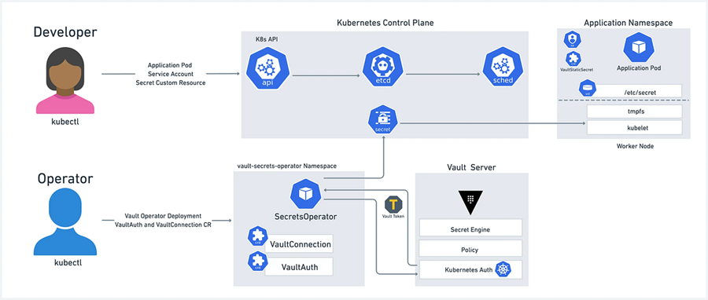
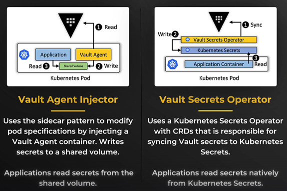

<p>
    
</p>

# Vault Secrets Operator - Overview

The Vault Secrets Operator (VSO) allows Pods to consume Vault secrets natively from Kubernetes Secrets. The Vault Secrets Operator (VSO) is a fully supported component of HashiCorp Vault.

- A kubernetes-native controller that syncs secrets from Vault to Kubernetes (one-way-sync)
- Rather than have pods go directly to Vault, they can read secrets natively from Kubernetes secrets
- Designed to make Vault secrets first-class citizen in Kubernetes

The Vault Secrets Operator operates by watching for changes to its supported set of Custom Resource Definitions (CRD). Each CRD provides the specification required to allow the operator to synchronize from one of the supported sources for secrets to a Kubernetes Secret. The operator writes the source secret data directly to the destination Kubernetes Secret, ensuring that any changes made to the source are replicated to the destination over its lifetime. In this way, an application only needs to have access to the destination secret in order to make use of the secret data contained within.

# Vault Secrets Operator vs Vault Agent

<p>
    
</p>

The Vault Secrets Operator (VSO) and the Vault Agent Injector are two popular methods for managing secrets in Kubernetes workloads. Both tools have their place, and some teams may use both depending on the use case. The choice should help your team move fast without sacrificing security or sanity. There are different methods for integrating Vault with Kubernetes.

- most teams choose between the Vault Agent Injector and the Vault Secret Operator for Kubernetes integration
- VSO it he newer option and is gaining popularity with teams using GitOps and declarative infrastructure models. Here's a comparison of their key features:

### Vault Secrets Operator (VSO)

Installs a controller in your cluster that uses Kubernetes-native CRDs to sync Vault secrets directly into Kubernetes Secrets. Applications read from a native Kubernetes secret, no Vault logic inside the pod. Ideal for GitOps workflows and managing multiple apps across teams and namespaces. 

**Capabilities**
- If you prefer a simple, more declarative approach that integrates easily with GitOps or CI/CD pipelines, the Vault Secrets Operator might be the better fit.
- It works best when you want secrets to feel native to Kubernetes
- You prefer using native Kubernetes Secrets or your applications require it
- You are manaing many apps across teams with centralized sunc logic

### Vault Agent Injector 

Works with a sidecar pattern, modifying your pod spec to inject a Vault Agent container alongside your application. It's simple and reliable for apps needing file-based secrets or tight control over template rendering and secret renewal. However, it adds complexity with sidecars, webhooks, and extra management. 

**Capabilities**
- This method is a srog fit when you need tight control over how and when secrets are injected.
- Choose it when your app or environment demands file-based secrets, renewal control, or runtime flexibility
- Your app requires secrets as files (e.g. TLS Certs)
- You want runtime secret injection per pod lifecycle
- You prefer a sidecar âttern for tighter control
- You need fine-gained renewal control or template rendering

### Comparative table

<table>
<tbody>
<tr>
<td><strong>Feature</strong></td>
<td>
<p><b>Vault Agent Injector</b></p>
</td>
<td>
<p><b>Vault Secrets Operator</b></p>
</td>
<td></td>
</tr>
<tr>
<td><b>Secret delivery</b></td>
<td><span style="font-weight: 400;">Sidecar volume</span></td>
<td><span style="font-weight: 400;">Kubernetes Secret</span></td>
<td></td>
</tr>
<tr>
<td><b>Dynamic secrets support</b></td>
<td><span style="font-weight: 400;">✅ Yes</span></td>
<td><span style="font-weight: 400;">❌ No (manual rotation)</span></td>
<td></td>
</tr>
<tr>
<td><b>Lease management</b></td>
<td><span style="font-weight: 400;">✅ Automatic</span></td>
<td><span style="font-weight: 400;">❌ No</span></td>
<td></td>
</tr>
<tr>
<td><b>GitOps-compatibility</b></td>
<td><span style="font-weight: 400;">⚠️ Limited (via annotations)</span></td>
<td><span style="font-weight: 400;">✅ Full (via CRDs)</span></td>
<td></td>
</tr>
<tr>
<td><b>Use of native K8s secrets</b></td>
<td><span style="font-weight: 400;">❌ No</span></td>
<td><span style="font-weight: 400;">✅ Yes</span></td>
<td></td>
</tr>
<tr>
<td><b>Dependency on Vault at pod startup</b></td>
<td><span style="font-weight: 400;">✅ Yes</span></td>
<td><span style="font-weight: 400;">❌ No</span></td>
<td></td>
</tr>
<tr>
<td><b>Best application</b></td>
<td><span style="font-weight: 400;">Dynamic credentials</span></td>
<td><span style="font-weight: 400;">Static configuration</span></td>
<td></td>
</tr>
</tbody>
</table>

# Vault Secrets Operator - Install

**Challenge**
Vault offers a complete solution for secrets lifecycle management, but that requires developers and operators to learn a new tool. Instead, developers want a cloud native way to access the secrets through Kubernetes and have no need to understand Vault in great depth. Vault Secrets Operator (VSO) updates Kubernetes native secrets. The user accesses Kubernetes native secrets managed on the back end by HashiCorp Vault.

**Solution**
- A Kubernetes operator is a software extension that uses custom resources to manage applications hosted on Kubernetes.
- The Vault Secrets Operator is a Kubernetes operator that syncs secrets between Vault and Kubernetes natively without requiring the users to learn details of Vault use.
- The Vault secrets operator supports kv-v1 and kv-v2, TLS certificates in PKI and full range of static and dynamic secrets.

### Prerequisite

- Docker
- Helm CLI
- k9s
- Kubernetes command-line interface (CLI)
- minikube
- Recent version of the Vault binary installed. Refer to the Vault install guide, and confirm you are using a version that supports VSO: please see Supported Vault versions.

### 1. Start minikube

Minikube allows you to run a miniature Kubernetes cluster on your local machine.

Create a minikube cluster.

``` bash
minikube start
```

### 2. Install Vault cluster

Using Helm install Vault on a local instance of minikube. In Kubernetes, install Vault on it's own virtual cluster called a namespace.

If you have not already, add the HashiCorp repository.

```bash
$ helm repo add hashicorp https://helm.releases.hashicorp.com
```

Update to the latest version of the HashiCorp Helm charts, update the repository.

```bash
$ helm repo update
Hang tight while we grab the latest from your chart repositories...
...Successfully got an update from the "hashicorp" chart repository
...Successfully got an update from the "open" chart repository
...Successfully got an update from the "bitnami" chart repository
Update Complete. ⎈Happy Helming!⎈
```
Details of the output might differ, the important thing is the Update Complete message.

Determine the latest version of Vault.

$ helm search repo hashicorp/vault
NAME                                    CHART VERSION   APP VERSION     DESCRIPTION
hashicorp/vault                         0.28.1          1.17.2          Official HashiCorp Vault Chart
hashicorp/vault-secrets-operator        0.7.1           0.8.0           Official Vault Secrets Operator Chart

Vault Secrets Operator supports the latest three versions of Vault. Please see Supported Vault versions for details.

Using the YAML file in the appropriate sub-folder, install Vault on your minikube cluster


Vault Community

Vault Enterprise
$ helm install vault hashicorp/vault -n vault --create-namespace --values vault/vault-values.yaml

The output should resemble the following:

NAME: vault
LAST DEPLOYED: Fri Mar 31 09:37:42 2023
NAMESPACE: vault
STATUS: deployed
REVISION: 1
NOTES:
Thank you for installing HashiCorp Vault!

Now that you have deployed Vault, you should look over the docs on using
Vault with Kubernetes available here:

https://www.vaultproject.io/docs/

Your release is named vault. To learn more about the release, try:
$ helm status vault
$ helm get manifest vault
Wait until the Vault pods are Ready 1/1 and status is Running.

# Documentation

- [Vault Agent Injector vs Secrets Operators](https://www.flowfactor.be/blogs/vault-agent-injector-vs-secrets-operator-kubernetes-comparison/)
- [Vault Agent Injector vs Secrets Operator](https://krausen.io/blog/vault-agent-injector-vs-vault-secrets-operator/)
- [Manage Kubernetes native secrets with the Vault Secrets Operator](https://developer.hashicorp.com/vault/tutorials/kubernetes-introduction/vault-secrets-operator)