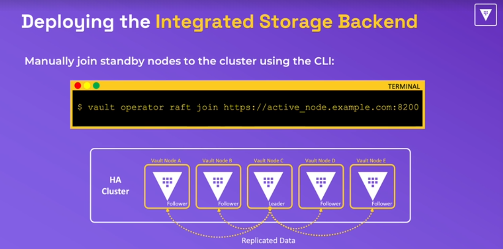
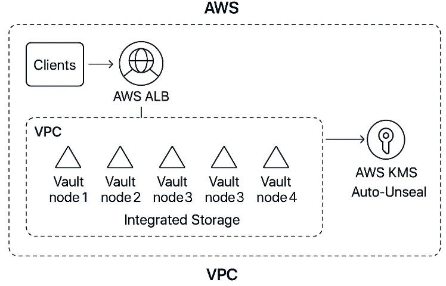
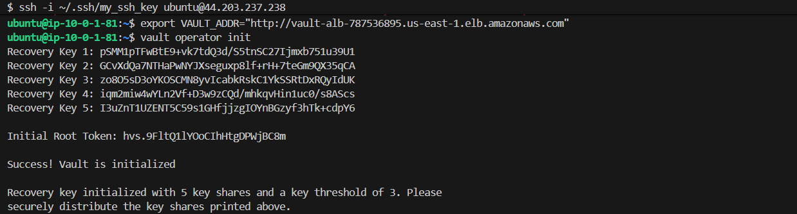
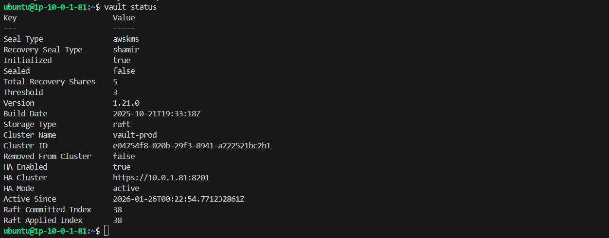

# Deploying Integrated Storage Backend

<p align="center">
    
</p>

## Why the ALB is Important in a Vault Architecture
1. Single, stable endpoint for clients 
- Without an ALB, clients must talk directly to individual Vault nodes
- That’s fragile. Nodes restart, fail, scale, or get replaced.
- With an ALB, clients use one endpoint
- The ALB handles routing to the correct node automatically

2. Health‑aware routing
- Vault exposes a health endpoint. The ALB continuously checks this and only sends traffic to nodes that are unsealed, active or standby, healthy
- This prevents clients from hitting sealed nodes, nodes still joining the cluster, nodes in maintenance, nodes recovering from Raft sync. This is essential for high availability.

**3. TLS termination (optional but common)**
The ALB can terminate TLS using an ACM certificate: 
- Simplifies certificate management, 
- Offloads TLS from Vault nodes, 
- Lets you rotate certificates without touching Vault
You can still run Vault with TLS internally if you want end‑to‑end encryption.

**4. Load balancing across standby nodes**
Vault’s Raft architecture allows:
- 1 active node
- N standby nodes
Standby nodes can serve read‑only requests (depending on your setup).
The ALB distributes traffic intelligently, improving performance and reducing load on the active node.

**5. Automatic failover**
If the active node fails:
- Raft elects a new leader
- ALB automatically routes traffic to the new active node
    - No DNS changes
    - No client reconfiguration
    - No manual intervention
This is a huge operational win.

**6. Security isolation**
The ALB acts as a controlled entry point:
- Only the ALB can reach port 8200 on Vault nodes
- Clients never talk directly to EC2 instances
- You can enforce WAF rules, IP restrictions, or mTLS at the ALB layer
This reduces the attack surface dramatically.

**7. Scalability and future-proofing**
If you add more Vault nodes:
- Just tag them correctly
- They auto-join the cluster
- ALB automatically starts routing to them
No client changes needed.

**🧠 In short**
The ALB gives you:
- High availability
- Health-aware routing
- TLS termination
- Security isolation
- Operational simplicity
- A single stable endpoint
**Without an ALB, you lose most of the reliability and manageability that make Vault production-ready.**


## High-level architecture

<p align="center">
    
</p>

- **4 EC2 instances** in the same VPC, same region.
- **Vault integrated storage (Raft)** for HA and data durability.
- **One load balancer** in front of the nodes.
- **TLS everywhere** (self-signed or ACM behind ALB) but not use here because of missing a valide certificate
- **Security groups** tightly scoped to:
    - Allow Vault API port (e.g. 8200) only from trusted sources / load balancer.
    - Allow Raft port (e.g. 8201) only between Vault nodes.

## Network and ports
**Pick ports (defaults are fine)**
- API: 8200/tcp
- Raft: 8201/tcp

**Security group rules:**
- Inbound 8200: from your admin IPs and/or load balancer.
- Inbound 8201: from the other Vault nodes’ security group only.
- SSH 22: from your admin IPs.


## 1. Prepare the EC2 instances

Below is a clean pattern:
- Terraform builds 3 EC2 instances, security group, IAM role.
- Each instance runs a cloud-init/user_data script that:
    - Installs Vault
    - Configures integrated storage (Raft)
    - Uses AWS auto-join based on tags to form the cluster.

## 2. Terraform files
You can fin Terraform files in the terraform directory in the project.
- [main.tf](../terraform/main.tf)
- [network.tf](../terraform/network.tf)
- [output.tf](../terraform/output.tf)
- [provider.tf](../terraform/provider.tf)
- [security.tf](../terraform/security.tf)
- [vars.tf](../terraform/vars.tf)
- [json file policy for ec2 and KMS](../terraform/ec2-policy.json)
- [json file role](../terraform/ec2-role.json)


## 3. User data: install and configure Vault with integrated storage

You can download the bash script [here](../scripts/install_vault_on_aws.sh). Other Terraform scripts can be found in the directory called Terraform in this project.

## 4. What happens when you `terraform apply`
**1. Terraform creates:**
- Security group
- IAM role + instance profile
- 4 EC2 instances with the right tags

**2. Each instance:**
- Installs Vault
- Writes a Raft + auto-join config
- Starts vault.service

**3. Vault nodes discover each other using:**
- `auto_join = "provider=aws tag_key=vault-cluster tag_value=vault-prod-cluster addr_type=private_v4"`


## 5. Testing the deployment
1. Open your AWS EC2 Dashboard. Go to Load Balancers section, select the ALB created and copy the ALB DNS name.
2. Attach the protocol in front of the ALB DSN name. If you are using the HTPPS you will have **https://<alb_dns_name>**. If you are using the HTTP protocol, then you will have **http://<alb_dns_name**>. 
In this demo, the HTTP protocol has been used and the ALB DNS name is *vault-alb-787536895.us-east-1.elb.amazonaws.com*. The Full Qualidied Domain Name (FQDN) is *http://vault-alb-787536895.us-east-1.elb.amazonaws.com*
3. Connect to each node and open a nex terminal. 
4. Export the environment variable and initialize vault

```bash
export VAULT_ADDR="http://vault-alb-787536895.us-east-1.elb.amazonaws.com"
```
```bash
vault operator init
```
<p>
    
</p>

5. Check the status of vault in the node
```bash
vault status
```
<p>
    
</p>


